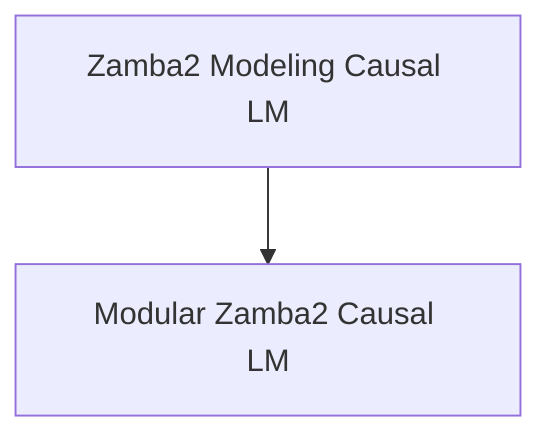
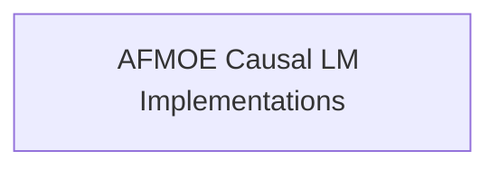

# Causal LM Models Documentation
# Causal LM Models Documentation

## Introduction

The `causal_lm_models` module focuses on implementing causal language models, specifically for the Zamba2 architecture. It provides different approaches to building and utilizing these models, catering to both comprehensive and modular implementations.

## Architecture Overview

The module is structured into distinct sub-modules, each handling a specific aspect of the Zamba2 Causal LM. The core functionality revolves around defining the model architecture, forward pass logic, and generation capabilities.

<!-- DIAGRAM_JSON
{
    "direction": "TD",
    "nodes": [
        {"id": "modeling_zamba2_causal_lm", "label": "Zamba2 Modeling Causal LM", "type": "module", "link": "modeling_zamba2_causal_lm.md"},
        {"id": "modular_zamba2_causal_lm", "label": "Modular Zamba2 Causal LM", "type": "module", "link": "modular_zamba2_causal_lm.md"}
    ],
    "edges": [
        {"source": "modeling_zamba2_causal_lm", "target": "modular_zamba2_causal_lm"}
    ],
    "groups": []
}
-->

## Sub-modules

*   **[Zamba2 Modeling Causal LM](modeling_zamba2_causal_lm.md)**: This sub-module contains the comprehensive implementation of the Zamba2 Causal Language Model.
*   **[Modular Zamba2 Causal LM](modular_zamba2_causal_lm.md)**: This sub-module provides a modular approach to the Zamba2 Causal Language Model, extending a base Zamba model.

## Introduction

The `causal_lm_models` module focuses on implementing causal language models, specifically for the Zamba2 architecture. It provides different approaches to building and utilizing these models, catering to both comprehensive and modular implementations.

## Architecture Overview

The module is structured into distinct sub-modules, each handling a specific aspect of the Zamba2 Causal LM. The core functionality revolves around defining the model architecture, forward pass logic, and generation capabilities.

<!-- DIAGRAM_JSON
{
    "direction": "TD",
    "nodes": [
        {"id": "modeling_zamba2_causal_lm", "label": "Zamba2 Modeling Causal LM", "type": "module", "link": "modeling_zamba2_causal_lm.md"},
        {"id": "modular_zamba2_causal_lm", "label": "Modular Zamba2 Causal LM", "type": "module", "link": "modular_zamba2_causal_lm.md"}
    ],
    "edges": [
        {"source": "modeling_zamba2_causal_lm", "target": "modular_zamba2_causal_lm"}
    ],
    "groups": []
}
-->

## Sub-modules

*   **[Zamba2 Modeling Causal LM](modeling_zamba2_causal_lm.md)**: This sub-module contains the comprehensive implementation of the Zamba2 Causal Language Model.
*   **[Modular Zamba2 Causal LM](modular_zamba2_causal_lm.md)**: This sub-module provides a modular approach to the Zamba2 Causal Language Model, extending a base Zamba model.

## Architecture Overview

The `causal_lm_models` module primarily acts as an aggregator for different causal language model implementations. Each implementation is encapsulated within its own sub-module, providing distinct model architectures and functionalities. The current focus is on the AFMOE architecture.

<!-- DIAGRAM_JSON
{
    "direction": "TD",
    "nodes": [
        {"id": "afmoe_causal_lm_implementations", "label": "AFMOE Causal LM Implementations", "type": "module", "link": "afmoe_causal_lm_implementations.md"}
    ],
    "edges": [],
    "groups": []
}
-->

## Sub-modules

### [AFMOE Causal LM Implementations](afmoe_causal_lm_implementations.md)
This sub-module provides different implementations of Causal Language Models based on the AFMOE architecture, including a modular version built upon Llama.