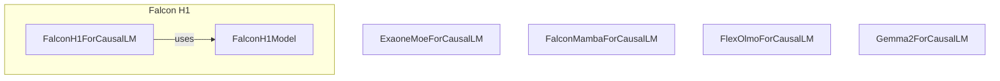

# causal_lm_models
This module provides various `ForCausalLM` classes for different model architectures, enabling causal language modeling and text generation. It includes specific model implementations like `FalconH1Model`.

<!-- DIAGRAM_JSON
{
  "nodes": [
    {"id": "ExaoneMoeForCausalLM", "label": "ExaoneMoeForCausalLM"},
    {"id": "FalconH1ForCausalLM", "label": "FalconH1ForCausalLM"},
    {"id": "FalconH1Model", "label": "FalconH1Model"},
    {"id": "FalconMambaForCausalLM", "label": "FalconMambaForCausalLM"},
    {"id": "FlexOlmoForCausalLM", "label": "FlexOlmoForCausalLM"},
    {"id": "Gemma2ForCausalLM", "label": "Gemma2ForCausalLM"}
  ],
  "edges": [
    {"source": "FalconH1ForCausalLM", "target": "FalconH1Model", "label": "uses"}
  ],
  "groups": [
    {"id": "FalconH1", "label": "Falcon H1", "nodes": ["FalconH1ForCausalLM", "FalconH1Model"]}
  ]
}
-->
