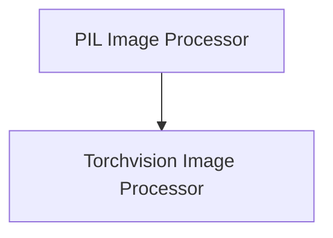

# Chameleon Image Processors

## Introduction
The `chameleon_image_processors` module provides specialized image processing utilities tailored for the Chameleon models. It includes robust functionalities for handling image resizing, cropping, normalization, and a custom RGB conversion method designed to gracefully manage images with transparency layers. This module is essential for preparing image data for various Chameleon model tasks, ensuring consistent input formats and optimal performance.

## Architecture Overview
The `chameleon_image_processors` module is structured into two primary sub-modules, each focusing on a different backend for image processing: `pil_processor` for PIL-based operations and `torchvision_processor` for Torchvision-based operations. Both leverage shared logic for operations like converting images to RGB, ensuring consistency while catering to specific backend optimizations.

<!-- DIAGRAM_JSON
{
    "direction": "TD",
    "nodes": [
        {"id": "pil_processor", "label": "PIL Image Processor", "type": "module", "link": "pil_processor.md"},
        {"id": "torchvision_processor", "label": "Torchvision Image Processor", "type": "module", "link": "torchvision_processor.md"}
    ],
    "edges": [
        {"source": "pil_processor", "target": "torchvision_processor"}
    ],
    "groups": []
}
-->

## Sub-modules

### [PIL Image Processor](pil_processor.md)
This sub-module (`pil_processor`) is responsible for image processing using the Pillow (PIL) library as its backend. It provides functionalities such as resizing, cropping, and a specialized `convert_to_rgb` method that correctly handles transparent (RGBA) images by blending them with a white background.

### [Torchvision Image Processor](torchvision_processor.md)
The `torchvision_processor` sub-module implements image processing functionalities using the Torchvision library. It includes similar features to the PIL processor but is optimized for PyTorch tensors, offering a custom `convert_to_rgb` and a robust `resize` method with a fallback mechanism for LANCZOS resampling to BICUBIC when processing tensors.
