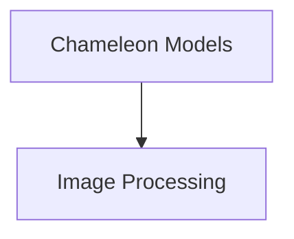

# Chameleon Models Documentation

## Introduction

The `chameleon_models` module provides core components specifically designed for the Chameleon model, focusing on image processing capabilities. It offers utilities to handle image manipulation, ensuring proper formatting and conversion for the model's requirements.

## Architecture Overview

The `chameleon_models` module is structured around its primary functionality: image processing. It contains a dedicated sub-module that encapsulates the logic for image manipulation and pre-processing tasks required by the Chameleon model.

<!-- DIAGRAM_JSON
{
    "direction": "TD",
    "nodes": [
        {"id": "image_processing", "label": "Chameleon Image Processing", "type": "module", "link": "image_processing.md"}
    ],
    "edges": [
        
    ],
    "groups": []
}
-->

## Sub-modules

### [Chameleon Image Processing](image_processing.md)

This sub-module is responsible for all image pre-processing steps for the Chameleon model. It includes functionalities such as custom RGB conversion for images with transparency layers and resizing operations, ensuring images are correctly prepared before being fed into the model. It provides both `TorchvisionBackend` and `PilBackend` implementations for flexibility.
