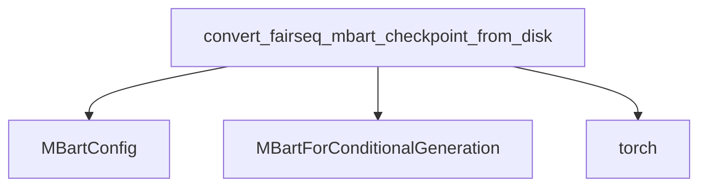

# Checkpoint Conversion Module

## Introduction

The `checkpoint_conversion` module, part of the `mbart_models` package, is responsible for converting pre-trained mBART model checkpoints from their original Fairseq format to a PyTorch-compatible format that can be used within the Hugging Face Transformers library. This module is crucial for enabling the seamless integration and further fine-tuning of mBART models.

## Core Functionality

This module provides the `convert_fairseq_mbart_checkpoint_from_disk` function, which handles the loading and transformation of Fairseq mBART checkpoints.

### `convert_fairseq_mbart_checkpoint_from_disk`

```python
def convert_fairseq_mbart_checkpoint_from_disk(
    checkpoint_path, hf_config_path="facebook/mbart-large-en-ro", finetuned=False, mbart_50=False
):
    state_dict = torch.load(checkpoint_path, map_location="cpu", weights_only=True)["model"]
    remove_ignore_keys_(state_dict)
    vocab_size = state_dict["encoder.embed_tokens.weight"].shape[0]

    mbart_config = MBartConfig.from_pretrained(hf_config_path, vocab_size=vocab_size)
    if mbart_50 and finetuned:
        mbart_config.activation_function = "relu"

    state_dict["shared.weight"] = state_dict["decoder.embed_tokens.weight"]
    model = MBartForConditionalGeneration(mbart_config)
    model.model.load_state_dict(state_dict)

    if finetuned:
        model.lm_head = make_linear_from_emb(model.model.shared)

    return model
```

This function performs the following steps:
1. **Loads Checkpoint**: Loads the Fairseq checkpoint from the specified `checkpoint_path` using `torch.load`.
2. **Removes Ignore Keys**: Calls `remove_ignore_keys_` to clean up the `state_dict`.
3. **Determines Vocabulary Size**: Extracts the vocabulary size from the encoder's embedding weights.
4. **Loads mBART Configuration**: Initializes an `MBartConfig` from a pre-trained configuration, updating the `vocab_size` and optionally setting the `activation_function` to "relu" if `mbart_50` and `finetuned` are true.
5. **Shared Weights**: Copies decoder embedding weights to `shared.weight` as required by the Hugging Face mBART model structure.
6. **Model Instantiation**: Creates an `MBartForConditionalGeneration` model using the configured `mbart_config`.
7. **Loads State Dict**: Loads the transformed `state_dict` into the `model.model` (the base mBART model).
8. **Handles Fine-tuned Models**: If the model is `finetuned`, it initializes the `lm_head` using `make_linear_from_emb` from the shared embeddings.
9. **Returns Model**: Returns the converted and loaded PyTorch mBART model.

## Architecture and Component Relationships

This module primarily interacts with the core mBART modeling components for configuration and model instantiation.

<!-- DIAGRAM_JSON
{
    "direction": "TD",
    "nodes": [
        {"id": "convert_fairseq_mbart_checkpoint_from_disk", "label": "convert_fairseq_mbart_checkpoint_from_disk", "type": "component", "link": null},
        {"id": "mbart_config", "label": "MBartConfig", "type": "external", "link": "modeling.md"},
        {"id": "mbart_for_conditional_generation", "label": "MBartForConditionalGeneration", "type": "external", "link": "modeling.md"},
        {"id": "torch", "label": "torch", "type": "external", "link": null}
    ],
    "edges": [
        {"source": "convert_fairseq_mbart_checkpoint_from_disk", "target": "mbart_config"},
        {"source": "convert_fairseq_mbart_checkpoint_from_disk", "target": "mbart_for_conditional_generation"},
        {"source": "convert_fairseq_mbart_checkpoint_from_disk", "target": "torch"}
    ],
    "groups": []
}
-->


## How the Module Fits into the Overall System

The `checkpoint_conversion` module is a utility module within the `mbart_models` ecosystem, specifically located under `bart_models`. Its primary role is to provide a bridge between externally trained Fairseq mBART models and the internal Hugging Face Transformers representation. This allows users to leverage pre-trained weights from Fairseq, convert them into the appropriate format, and then use them with the various functionalities provided by the `modeling` module (e.g., for inference or further fine-tuning).

It ensures compatibility and reusability of models, making it easier for developers to work with mBART models trained in different frameworks. This module is typically used as a one-off conversion script rather than being a core part of the inference or training pipeline itself, but it's essential for initial model setup. The converted models can then be saved and loaded directly using the standard Hugging Face model loading mechanisms. The core model definitions and configurations are handled by the [modeling](modeling.md) module within `mbart_models`.