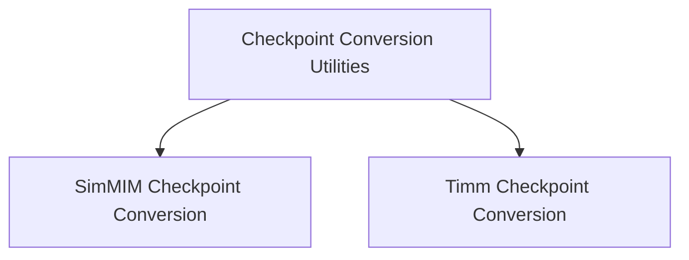

# Checkpoint Conversion Utilities

This module provides essential utilities for converting pre-trained Swin transformer model checkpoints from various sources (like SimMIM and Timm) into the Hugging Face PyTorch format. This facilitates seamless integration and usage of Swin models within the Hugging Face ecosystem, enabling tasks such as masked image modeling and image classification.

## Architecture Overview

The `checkpoint_conversion_utilities` module is structured into specialized sub-modules, each responsible for converting checkpoints from a specific pre-training source. This modular design ensures clear separation of concerns and simplifies the process of adding support for new checkpoint formats.

<!-- DIAGRAM_JSON
{
    "direction": "TD",
    "nodes": [
        {"id": "simmim_conversion", "label": "SimMIM Checkpoint Conversion", "type": "module", "link": "simmim_conversion.md"},
        {"id": "timm_conversion", "label": "Timm Checkpoint Conversion", "type": "module", "link": "timm_conversion.md"}
    ],
    "edges": [
        {"source": "checkpoint_conversion_utilities", "target": "simmim_conversion"},
        {"source": "checkpoint_conversion_utilities", "target": "timm_conversion"}
    ],
    "groups": [
        {"id": "checkpoint_conversion_utilities", "label": "Checkpoint Conversion Utilities"}
    ]
}
-->

## Sub-modules

This module is composed of the following sub-modules:

*   ### [SimMIM Checkpoint Conversion](simmim_conversion.md)
    This sub-module focuses on converting Swin models pre-trained with the SimMIM (Self-supervised Image Masked Modeling) approach. It includes utilities to load SimMIM checkpoints and adapt them to the Hugging Face `SwinForMaskedImageModeling` architecture.

*   ### [Timm Checkpoint Conversion](timm_conversion.md)
    This sub-module handles the conversion of Swin models pre-trained using the Timm (PyTorch Image Models) library. It provides functionalities to load Timm-style checkpoints and transform them into the Hugging Face `SwinForImageClassification` architecture, ensuring compatibility and correct functionality for image classification tasks.