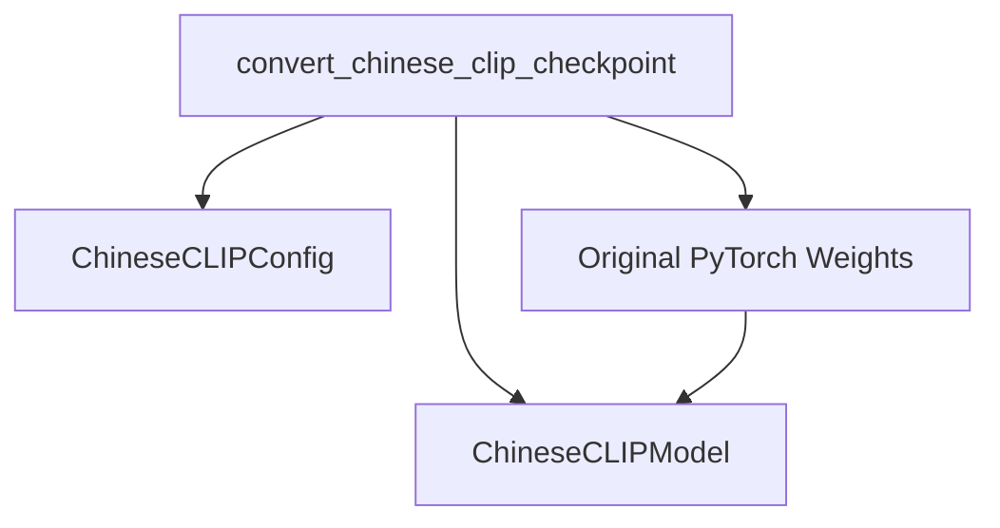

# Chinese_CLIP_Models Module Documentation

## Introduction
The `chinese_clip_models` module is a crucial component within the Transformers library, specifically designed to facilitate the conversion of pre-trained Chinese CLIP model checkpoints from their original PyTorch format to the Hugging Face Transformers compatible format. This conversion enables seamless integration and utilization of Chinese CLIP models within the broader Hugging Face ecosystem, allowing for easy loading, fine-tuning, and deployment.

## Purpose and Functionality
The primary purpose of this module is to provide a robust and straightforward mechanism for migrating original Chinese CLIP model weights. It addresses the compatibility challenges between different model implementations by adjusting the weight names and structures to match the Hugging Face Transformers' `ChineseCLIPModel` architecture. This ensures that users can leverage existing Chinese CLIP checkpoints without having to re-train models from scratch.

The core functionality revolves around the `convert_chinese_clip_checkpoint` function, which handles the entire conversion process, including:
- Loading the Chinese CLIP model configuration.
- Initializing an empty Hugging Face `ChineseCLIPModel`.
- Loading the original PyTorch state dictionary.
- Mapping and copying the weights for both the text and vision components, as well as the `logit_scale`.
- Saving the converted model in the Hugging Face format.

## Module Architecture
The `chinese_clip_models` module, at its core, provides the necessary utility for converting original Chinese CLIP PyTorch checkpoints.

<!-- DIAGRAM_JSON
{
    "direction": "TD",
    "nodes": [
        {"id": "convert_chinese_clip_checkpoint", "label": "convert_chinese_clip_checkpoint", "type": "component", "link": null},
        {"id": "chinese_clip_config", "label": "ChineseCLIPConfig", "type": "external", "link": null},
        {"id": "chinese_clip_model", "label": "ChineseCLIPModel", "type": "external", "link": null},
        {"id": "pt_weights", "label": "Original PyTorch Weights", "type": "component", "link": null}
    ],
    "edges": [
        {"source": "convert_chinese_clip_checkpoint", "target": "chinese_clip_config"},
        {"source": "convert_chinese_clip_checkpoint", "target": "chinese_clip_model"},
        {"source": "convert_chinese_clip_checkpoint", "target": "pt_weights"},
        {"source": "pt_weights", "target": "chinese_clip_model"}
    ],
    "groups": []
}
-->

### Component Relationships
- `convert_chinese_clip_checkpoint`: This is the central function that orchestrates the conversion. It takes the path to the original checkpoint, the desired output folder, and an optional configuration path.
- `ChineseCLIPConfig`: An external dependency used to load the configuration for the Chinese CLIP model, ensuring the Hugging Face model is initialized with the correct architecture parameters.
- `ChineseCLIPModel`: An external dependency representing the target Hugging Face model architecture into which the converted weights are loaded.
- `Original PyTorch Weights`: Represents the loaded state dictionary from the original PyTorch checkpoint, which serves as the source for the weight conversion.

## Key Components

### `convert_chinese_clip_checkpoint`
- **Location:** `src.transformers.models.chinese_clip.convert_chinese_clip_original_pytorch_to_hf.convert_chinese_clip_checkpoint`
- **Description:** This function is the entry point for the conversion process. It takes the path to the original `.pth` checkpoint file, the directory where the converted Hugging Face model should be saved, and an optional path to the `ChineseCLIPConfig` JSON file.
- **Functionality:**
    1.  Loads the `ChineseCLIPConfig` to define the model architecture.
    2.  Instantiates an empty `ChineseCLIPModel` based on the loaded configuration.
    3.  Loads the state dictionary from the original PyTorch checkpoint.
    4.  Renames the keys in the loaded state dictionary to match the Hugging Face `ChineseCLIPModel`'s expected key names by removing the `module.` prefix.
    5.  Calls helper functions (`copy_text_model_and_projection` and `copy_vision_model_and_projection`, which are implicitly part of this conversion logic) to copy the specific weights for the text and vision encoders, and their respective projection layers.
    6.  Copies the `logit_scale` parameter directly.
    7.  Saves the fully converted `hf_model` to the specified `pytorch_dump_folder_path`.

This module plays a vital role in bridging the gap between original Chinese CLIP implementations and the Hugging Face Transformers library, promoting reusability and accessibility of these powerful models.