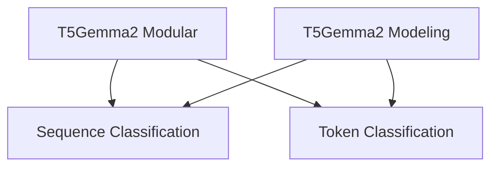
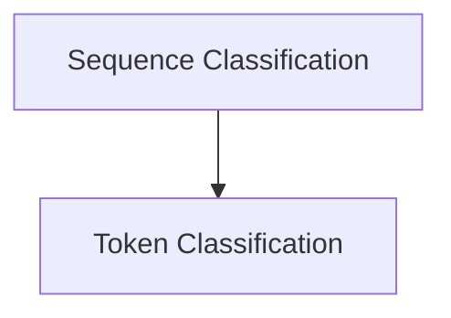

# Classification Models
# Classification Models

The `classification_models` module provides implementations for various classification tasks using the T5Gemma2 architecture. It offers specialized models for both sequence-level and token-level classification, building upon the core T5Gemma2 model.

## Architecture Overview

The module is structured into distinct sub-modules, each focusing on a specific classification task. These sub-modules leverage shared components from the broader T5Gemma2 modeling and modular frameworks to ensure consistency and efficiency.

<!-- DIAGRAM_JSON
{
    "direction": "TD",
    "nodes": [
        {"id": "t5gemma2_modular", "label": "T5Gemma2 Modular", "type": "module", "link": "t5gemma2_modular.md"},
        {"id": "t5gemma2_modeling", "label": "T5Gemma2 Modeling", "type": "module", "link": "t5gemma2_modeling.md"},
        {"id": "sequence_classification", "label": "Sequence Classification", "type": "module", "link": "sequence_classification.md"},
        {"id": "token_classification", "label": "Token Classification", "type": "module", "link": "token_classification.md"}
    ],
    "edges": [
        {"source": "t5gemma2_modular", "target": "sequence_classification"},
        {"source": "t5gemma2_modular", "target": "token_classification"},
        {"source": "t5gemma2_modeling", "target": "sequence_classification"},
        {"source": "t5gemma2_modeling", "target": "token_classification"}
    ],
    "groups": []
}
-->

## Sub-modules

### [Sequence Classification](sequence_classification.md)
This sub-module focuses on models designed for sequence-level classification tasks. It provides the `T5Gemma2ForSequenceClassification` component, which is instrumental in assigning a single label to an entire input sequence.

### [Token Classification](token_classification.md)
This sub-module handles models for token-level classification, where each token in an input sequence is assigned a specific label. The `T5Gemma2ForTokenClassification` component is a key part of this sub-module.

This module (`classification_models`) provides implementations for various classification tasks using the T5Gemma2 model architecture. It includes specialized models for sequence-level and token-level classification, leveraging the underlying T5Gemma2 model for robust feature extraction and prediction.

## Architecture Overview

The `classification_models` module is structured to offer distinct functionalities for different classification needs. It comprises the following key sub-modules:

<!-- DIAGRAM_JSON
{
    "direction": "TD",
    "nodes": [
        {"id": "sequence_classification", "label": "Sequence Classification", "type": "module", "link": "sequence_classification.md"},
        {"id": "token_classification", "label": "Token Classification", "type": "module", "link": "token_classification.md"}
    ],
    "edges": [
        {"source": "sequence_classification", "target": "token_classification"}
    ],
    "groups": []
}
-->

## Sub-modules

### [Sequence Classification](sequence_classification.md)
This sub-module focuses on classifying entire input sequences. It utilizes the `T5Gemma2ForSequenceClassification` component to process sequences and predict a single label representing the sequence's category.

### [Token Classification](token_classification.md)
This sub-module handles classification tasks at the token level. It employs the `T5Gemma2ForTokenClassification` component to assign a label to each token in the input sequence, useful for tasks like named entity recognition or part-of-speech tagging.
