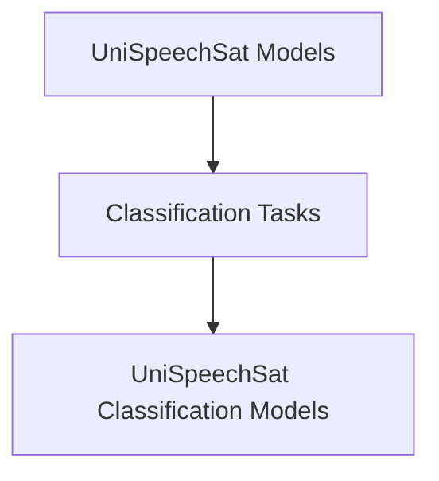

# UniSpeechSat Classification Tasks

## Introduction
The `classification_tasks` module provides specialized models for various classification tasks utilizing the UniSpeechSat architecture. These models extend the core UniSpeechSat functionality to perform both sequence-level and audio frame-level classifications, making them suitable for tasks such as sentiment analysis on speech or sound event detection.

## Architecture
The classification models in this module are built on top of the [unispeech_sat_models](unispeech_sat_models.md) core architecture. They leverage the feature extraction and hidden state processing capabilities of the base UniSpeechSat model and add specific classification heads for downstream tasks. This design allows for efficient transfer learning and fine-tuning of pre-trained UniSpeechSat models for classification.

<!-- DIAGRAM_JSON
{
    "direction": "TD",
    "nodes": [
        {"id": "unispeech_sat_models", "label": "UniSpeechSat Models", "type": "module", "link": "unispeech_sat_models.md"},
        {"id": "classification_tasks", "label": "Classification Tasks", "type": "module", "link": "classification_tasks.md"},
        {"id": "unispeech_sat_classification_models", "label": "UniSpeechSat Classification Models", "type": "module", "link": "unispeech_sat_classification_models.md"}
    ],
    "edges": [
        {"source": "unispeech_sat_models", "target": "classification_tasks"},
        {"source": "classification_tasks", "target": "unispeech_sat_classification_models"}
    ],
    "groups": []
}
-->

## Sub-modules

### [UniSpeechSat Classification Models](unispeech_sat_classification_models.md)
This sub-module contains implementations for sequence and audio frame classification using the UniSpeechSat model. It provides classes like `UniSpeechSatForSequenceClassification` for tasks where a single label is predicted for the entire input sequence, and `UniSpeechSatForAudioFrameClassification` for tasks requiring predictions for each audio frame.
