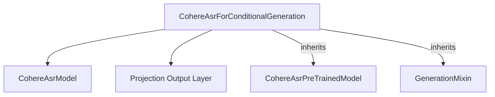

# Cohere ASR Models Documentation

The `cohere_asr_models` module provides the core implementation for the Cohere Automatic Speech Recognition (ASR) model, specifically designed for conditional generation tasks. It enables the conversion of audio input into transcribed text.

## Architecture and Core Components

The primary component within this module is `CohereAsrForConditionalGeneration`, which leverages an encoder-decoder architecture for sequence-to-sequence tasks. It builds upon foundational utilities for model generation and pre-trained model handling.

### CohereAsrForConditionalGeneration

`CohereAsrForConditionalGeneration` is the main class responsible for the conditional generation capabilities of the Cohere ASR model. It inherits from `CohereAsrPreTrainedModel` for common pre-trained model functionalities and from [`GenerationMixin`](generation_mixins.md) for its text generation capabilities.

**Key features and components:**

*   **`model`**: An internal instance of `CohereAsrModel` that forms the backbone of the ASR system, likely handling the audio feature encoding and sequence decoding. (The code for `CohereAsrModel` is not provided in this context, but it's a core dependency).
*   **`proj_out`**: A linear layer that projects the hidden states from the `CohereAsrModel`'s decoder to the vocabulary size, producing the final logits for token prediction.
*   **`forward` method**: This method takes `input_features` (raw speech waveform features) and other optional parameters to generate transcribed text. It utilizes the internal `CohereAsrModel` to process the input and the `proj_out` layer to produce output logits. It also handles shifting of tokens for decoder input and calculates loss if `labels` are provided.
*   **`prepare_inputs_for_generation`**: A method overridden to absorb `audio_chunk_index` from the processor, ensuring compatibility with the generation process.

### How it Fits into the Overall System

This module serves as the direct interface for performing ASR tasks using Cohere models. It integrates with feature extractors (e.g., `AutoFeatureExtractor`) to prepare audio inputs and utilizes the `GenerationMixin` for flexible text generation strategies. Its outputs can be further processed by tokenizers (e.g., `AutoProcessor` for batch decoding) to obtain the final human-readable transcription.

<!-- DIAGRAM_JSON
{
    "direction": "TD",
    "nodes": [
        {"id": "cohere_asr_for_conditional_generation", "label": "CohereAsrForConditionalGeneration", "type": "component", "link": null},
        {"id": "cohere_asr_model", "label": "CohereAsrModel", "type": "component", "link": null},
        {"id": "proj_out_layer", "label": "Projection Output Layer", "type": "component", "link": null},
        {"id": "cohere_asr_pretrained_model", "label": "CohereAsrPreTrainedModel", "type": "component", "link": null},
        {"id": "generation_mixin", "label": "GenerationMixin", "type": "external", "link": "generation_mixins.md"}
    ],
    "edges": [
        {"source": "cohere_asr_for_conditional_generation", "target": "cohere_asr_model"},
        {"source": "cohere_asr_for_conditional_generation", "target": "proj_out_layer"},
        {"source": "cohere_asr_for_conditional_generation", "target": "cohere_asr_pretrained_model", "label": "inherits"},
        {"source": "cohere_asr_for_conditional_generation", "target": "generation_mixin", "label": "inherits"}
    ],
    "groups": []
}
-->

