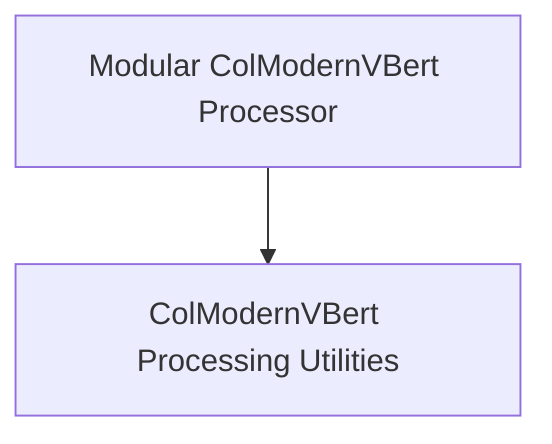

# ColModernVBert Models Documentation

## Introduction

The `colmodernvbert_models` module provides the core components for processing images and text queries within the ColModernVBert framework. It includes specialized processors for handling multimodal inputs, generating visual prompts, processing queries for retrieval, and computing late-interaction retrieval scores.

## Architecture Overview

The module is composed of two primary sub-modules, each providing a `ColModernVBertProcessor` implementation with specific functionalities. These processors facilitate the preparation of data for ColModernVBert models.

<!-- DIAGRAM_JSON
{
    "direction": "TD",
    "nodes": [
        {"id": "modular_processor", "label": "Modular ColModernVBert Processor", "type": "module", "link": "modular_processor.md"},
        {"id": "processing_processor", "label": "ColModernVBert Processing Utilities", "type": "module", "link": "processing_processor.md"}
    ],
    "edges": [
        {"source": "modular_processor", "target": "processing_processor"}
    ],
    "groups": []
}
-->

## Sub-modules

### [Modular ColModernVBert Processor](modular_processor.md)
This sub-module contains the `ColModernVBertProcessor` as defined in `src.transformers.models.colmodernvbert.modular_colmodernvbert.ColModernVBertProcessor`. It focuses on modular processing of images and queries, including the computation of late-interaction retrieval scores. It is designed to wrap a `ModernVBertProcessor` and extend its capabilities for multimodal inputs.

### [ColModernVBert Processing Utilities](processing_processor.md)
This sub-module houses the `ColModernVBertProcessor` from `src.transformers.models.colmodernvbert.processing_colmodernvbert.ColModernVBertProcessor`. This implementation provides comprehensive utilities for handling multimodal inputs, including detailed image processing, text tokenization with special multimodal tokens, and the creation of `mm_token_type_ids` for complex input structures. It also includes methods for processing queries and calculating retrieval scores, similar to its modular counterpart but with potentially more explicit control over token handling and image patch calculations.