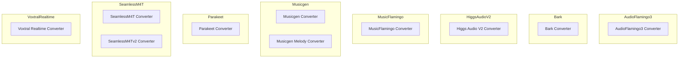

# complex_audio_model_integrations
This module provides integration scripts for converting various complex audio and speech models, such as AudioFlamingo3, Musicgen, SeamlessM4T, and others, into the Hugging Face Transformers format for easier use and sharing.

<!-- DIAGRAM_JSON
{
  "nodes": [
    {
      "id": "AF3_main",
      "label": "AudioFlamingo3 Converter"
    },
    {
      "id": "Bark_load",
      "label": "Bark Converter"
    },
    {
      "id": "HAV2_main",
      "label": "Higgs Audio V2 Converter"
    },
    {
      "id": "MF_main",
      "label": "MusicFlamingo Converter"
    },
    {
      "id": "MG_convert",
      "label": "Musicgen Converter"
    },
    {
      "id": "MGM_convert",
      "label": "Musicgen Melody Converter"
    },
    {
      "id": "Parakeet_main",
      "label": "Parakeet Converter"
    },
    {
      "id": "SM4T_load",
      "label": "SeamlessM4T Converter"
    },
    {
      "id": "SM4Tv2_load",
      "label": "SeamlessM4Tv2 Converter"
    },
    {
      "id": "VR_main",
      "label": "Voxtral Realtime Converter"
    }
  ],
  "edges": [],
  "groups": [
    {
      "id": "AudioFlamingo3",
      "label": "AudioFlamingo3",
      "nodes": ["AF3_main"]
    },
    {
      "id": "Bark",
      "label": "Bark",
      "nodes": ["Bark_load"]
    },
    {
      "id": "HiggsAudioV2",
      "label": "Higgs Audio V2",
      "nodes": ["HAV2_main"]
    },
    {
      "id": "MusicFlamingo",
      "label": "MusicFlamingo",
      "nodes": ["MF_main"]
    },
    {
      "id": "Musicgen",
      "label": "Musicgen",
      "nodes": ["MG_convert", "MGM_convert"]
    },
    {
      "id": "Parakeet",
      "label": "Parakeet",
      "nodes": ["Parakeet_main"]
    },
    {
      "id": "SeamlessM4T",
      "label": "SeamlessM4T",
      "nodes": ["SM4T_load", "SM4Tv2_load"]
    },
    {
      "id": "VoxtralRealtime",
      "label": "Voxtral Realtime",
      "nodes": ["VR_main"]
    }
  ]
}
-->
