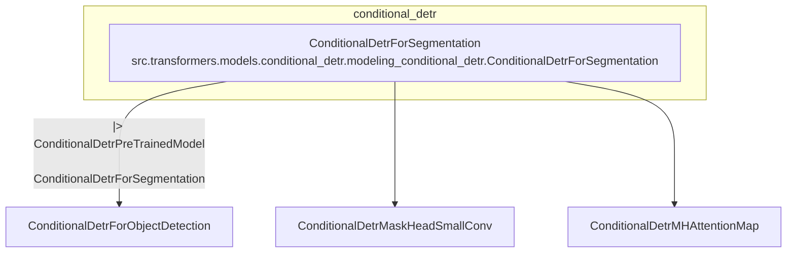

# conditional_detr
This module provides the `ConditionalDetrForSegmentation` class, which extends object detection capabilities with a segmentation head for instance segmentation tasks.

<!-- DIAGRAM_JSON
{
    "nodes": [
        {
            "id": "ConditionalDetrForSegmentation",
            "label": "ConditionalDetrForSegmentation",
            "url": "src.transformers.models.conditional_detr.modeling_conditional_detr.ConditionalDetrForSegmentation"
        },
        {
            "id": "ConditionalDetrPreTrainedModel",
            "label": "ConditionalDetrPreTrainedModel"
        },
        {
            "id": "ConditionalDetrForObjectDetection",
            "label": "ConditionalDetrForObjectDetection"
        },
        {
            "id": "ConditionalDetrMaskHeadSmallConv",
            "label": "ConditionalDetrMaskHeadSmallConv"
        },
        {
            "id": "ConditionalDetrMHAttentionMap",
            "label": "ConditionalDetrMHAttentionMap"
        }
    ],
    "edges": [
        {
            "source": "ConditionalDetrForSegmentation",
            "target": "ConditionalDetrPreTrainedModel",
            "type": "inheritance"
        },
        {
            "source": "ConditionalDetrForSegmentation",
            "target": "ConditionalDetrForObjectDetection",
            "type": "composition"
        },
        {
            "source": "ConditionalDetrForSegmentation",
            "target": "ConditionalDetrMaskHeadSmallConv",
            "type": "composition"
        },
        {
            "source": "ConditionalDetrForSegmentation",
            "target": "ConditionalDetrMHAttentionMap",
            "type": "composition"
        }
    ],
    "groups": [
        {
            "id": "conditional_detr",
            "label": "conditional_detr",
            "nodes": [
                "ConditionalDetrForSegmentation"
            ]
        }
    ]
}
-->
