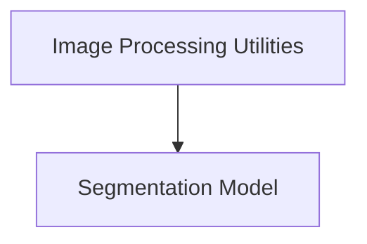

# Conditional DETR Models

The `conditional_detr_models` module provides core functionalities for image processing and segmentation using the Conditional DETR architecture. It includes components for efficient image data preparation and a robust segmentation model.

## Architecture Overview

This module is structured into two main sub-modules: `image_processing` and `segmentation_model`. The `image_processing` sub-module is responsible for transforming raw image data and annotations into a format suitable for the `segmentation_model`, which then performs the actual segmentation task.

<!-- DIAGRAM_JSON
{
    "direction": "TD",
    "nodes": [
        {"id": "image_processing", "label": "Image Processing Utilities", "type": "module", "link": "image_processing.md"},
        {"id": "segmentation_model", "label": "Segmentation Model", "type": "module", "link": "segmentation_model.md"}
    ],
    "edges": [
        {"source": "image_processing", "target": "segmentation_model"}
    ],
    "groups": []
}
-->

## Sub-modules

### Image Processing Utilities

This sub-module, documented in [image_processing.md](image_processing.md), contains the `ConditionalDetrImageProcessorPil` component. It handles all necessary image pre-processing steps, including resizing, normalization, padding, and preparing annotations (bounding boxes, masks) for input into the Conditional DETR model. It also provides methods for post-processing the model's outputs for object detection, semantic segmentation, instance segmentation, and panoptic segmentation.

### Segmentation Model

Detailed in [segmentation_model.md](segmentation_model.md), this sub-module features the `ConditionalDetrForSegmentation` class. This class implements the Conditional DETR model specifically adapted for segmentation tasks. It integrates the Conditional DETR object detection model with a dedicated mask head to generate segmentation masks based on the detected objects.