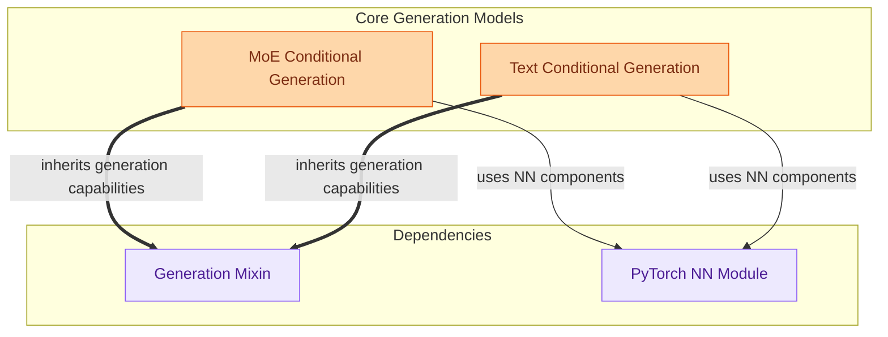

# Conditional Generation Module

This module provides classes for sequence-to-sequence conditional generation across various model architectures, including Mixture-of-Experts (MoE) and specialized text-based models, handling model execution and loss computation.

<!-- DIAGRAM_JSON
{
    "direction": "TD",
    "nodes": [
        {"id": "moe_conditional_generation", "label": "MoE Conditional Generation", "type": "module", "link": "moe_conditional_generation.md"},
        {"id": "text_conditional_generation", "label": "Text Conditional Generation", "type": "module", "link": "text_conditional_generation.md"},
        {"id": "generation_mixin", "label": "Generation Mixin", "type": "external"},
        {"id": "torch_nn", "label": "PyTorch NN Module", "type": "external"}
    ],
    "edges": [
        {"source": "moe_conditional_generation", "target": "generation_mixin", "label": "inherits generation capabilities"},
        {"source": "text_conditional_generation", "target": "generation_mixin", "label": "inherits generation capabilities"},
        {"source": "moe_conditional_generation", "target": "torch_nn", "label": "uses NN components"},
        {"source": "text_conditional_generation", "target": "torch_nn", "label": "uses NN components"}
    ],
    "groups": [
        {"id": "core_generation", "label": "Core Generation Models", "role": "generative", "nodes": ["moe_conditional_generation", "text_conditional_generation"]},
        {"id": "dependencies", "label": "Dependencies", "role": "analytical", "nodes": ["generation_mixin", "torch_nn"]}
    ]
}
-->
