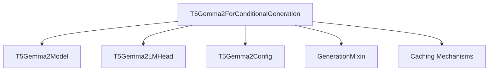

The `conditional_generation_models` module focuses on implementing conditional generation capabilities, specifically for the `T5Gemma2` model architecture. It provides the core class `T5Gemma2ForConditionalGeneration`, which extends the base `T5Gemma2PreTrainedModel` with functionalities for generating sequences based on given conditions. This module plays a crucial role in enabling text generation, image captioning, and other sequence-to-sequence tasks within the larger system.

### Architecture and Component Relationships

The `conditional_generation_models` module, located within the `t5gemma2_modular` sub-module of `t5gemma2_models`, primarily houses the `T5Gemma2ForConditionalGeneration` class. This class integrates the core `T5Gemma2` model, a language model head, and generation utilities to perform conditional text generation.

#### Core Components

*   **`T5Gemma2ForConditionalGeneration`**: This is the main class within the module. It inherits from `T5Gemma2PreTrainedModel` and `GenerationMixin`, providing a robust framework for conditional generation tasks. It encapsulates the complete forward pass, including encoder processing, decoder processing, and language model head application to produce logits. It also handles the preparation and management of key-value caches for efficient generation.

#### Component Relationships and Dependencies

The `T5Gemma2ForConditionalGeneration` class orchestrates several components to achieve its functionality:

*   **`T5Gemma2Model`**: The core T5Gemma2 model architecture is an essential dependency. `T5Gemma2ForConditionalGeneration` instantiates and utilizes this model to perform the encoder-decoder operations, processing both input (text, optionally image features) and generating hidden states for the decoder. This component is expected to reside within the [t5gemma2_modeling](t5gemma2_modeling.md) module.
*   **`T5Gemma2LMHead`**: This component is the language model head responsible for mapping the decoder's hidden states to the vocabulary space, producing the final logits. It's configured with the decoder's hidden size and the vocabulary size. This component is also expected to be defined within the [t5gemma2_modeling](t5gemma2_modeling.md) module.
*   **`T5Gemma2Config`**: The configuration object for the T5Gemma2 model, providing essential hyperparameters and architectural details required for initializing `T5Gemma2Model` and `T5Gemma2LMHead`. This configuration is typically found in the [t5gemma2_modeling](t5gemma2_modeling.md) module.
*   **`GenerationMixin`**: This mixin, from the [generation_mixins](generation_mixins.md) module, provides common methods and utilities for text generation, such as `generate()`. `T5Gemma2ForConditionalGeneration` leverages this mixin to offer a standardized generation API.
*   **Caching Mechanisms (`EncoderDecoderCache`, `DynamicCache`, `StaticCache`)**: The module implements advanced caching strategies to optimize generation, particularly for cross-attention mechanisms. These caching utilities are typically found in general [modeling_utilities](modeling_utilities.md).

### System Integration

The `conditional_generation_models` module serves as the primary entry point for conditional generation tasks using the T5Gemma2 architecture. It integrates with other modules as follows:

*   **`t5gemma2_models`**: As part of the `t5gemma2_models` family, this module is tightly coupled with the core T5Gemma2 model definitions and configurations provided by `t5gemma2_modeling`.
*   **`generation_mixins`**: By inheriting `GenerationMixin`, it adheres to a standard interface for text generation across various models, allowing for consistent interaction with generation pipelines.
*   **`modeling_utilities`**: It relies on general modeling utilities for managing model configurations, cache mechanisms, and potentially other common operations.

<!-- DIAGRAM_JSON
{
    "direction": "TD",
    "nodes": [
        {"id": "t5gemma2_for_conditional_generation", "label": "T5Gemma2ForConditionalGeneration", "type": "component", "link": null},
        {"id": "t5gemma2_model", "label": "T5Gemma2Model", "type": "external", "link": "t5gemma2_modeling.md"},
        {"id": "t5gemma2_lm_head", "label": "T5Gemma2LMHead", "type": "external", "link": "t5gemma2_modeling.md"},
        {"id": "t5gemma2_config", "label": "T5Gemma2Config", "type": "external", "link": "t5gemma2_modeling.md"},
        {"id": "generation_mixin", "label": "GenerationMixin", "type": "external", "link": "generation_mixins.md"},
        {"id": "cache_mechanisms", "label": "Caching Mechanisms", "type": "external", "link": "modeling_utilities.md"}
    ],
    "edges": [
        {"source": "t5gemma2_for_conditional_generation", "target": "t5gemma2_model"},
        {"source": "t5gemma2_for_conditional_generation", "target": "t5gemma2_lm_head"},
        {"source": "t5gemma2_for_conditional_generation", "target": "t5gemma2_config"},
        {"source": "t5gemma2_for_conditional_generation", "target": "generation_mixin"},
        {"source": "t5gemma2_for_conditional_generation", "target": "cache_mechanisms"}
    ],
    "groups": []
}
-->


**Workflow:**

1.  Input data (e.g., `input_ids`, `pixel_values`) is passed to the `forward` method of `T5Gemma2ForConditionalGeneration`.
2.  The `forward` method delegates to `self.model` (an instance of `T5Gemma2Model`) to process the inputs through its encoder and decoder.
3.  The `T5Gemma2LMHead` then transforms the decoder's `last_hidden_state` into `logits`.
4.  If labels are provided, a loss is computed.
5.  During generation, the `_prepare_cache_for_generation` method, potentially using components from `modeling_utilities`, optimizes the `past_key_values` for efficient sequence generation.
6.  The `GenerationMixin` provides the high-level API for various generation strategies (e.g., greedy, beam search).

This modular design ensures clear separation of concerns, making the `T5Gemma2ForConditionalGeneration` class maintainable and extensible for future enhancements to conditional generation tasks.

The `conditional_generation_models` module provides the core functionality for conditional text generation using the Longformer-Encoder-Decoder (LED) model architecture. It specifically focuses on the `LEDForConditionalGeneration` class, which extends the base LED model with capabilities for sequence-to-sequence tasks such as summarization and conditional text generation.

## Architecture

The `LEDForConditionalGeneration` class integrates the foundational `LEDModel` with the `GenerationMixin` to enable advanced generation features. It handles the processing of inputs, including attention masks and labels, to produce coherent and contextually relevant text outputs.

<!-- DIAGRAM_JSON
{
    "direction": "TD",
    "nodes": [
        {"id": "led_for_conditional_generation", "label": "LEDForConditionalGeneration", "type": "component", "link": null},
        {"id": "led_model", "label": "LEDModel", "type": "external", "link": "led_models.md"},
        {"id": "generation_mixin", "label": "GenerationMixin", "type": "external", "link": "generation_mixins.md"},
        {"id": "led_config", "label": "LEDConfig", "type": "external", "link": "led_models.md"},
        {"id": "shift_tokens_right", "label": "shift_tokens_right (Utility)", "type": "component", "link": null}
    ],
    "edges": [
        {"source": "led_for_conditional_generation", "target": "led_model"},
        {"source": "led_for_conditional_generation", "target": "generation_mixin"},
        {"source": "led_for_conditional_generation", "target": "led_config"},
        {"source": "led_for_conditional_generation", "target": "shift_tokens_right"}
    ],
    "groups": []
}
-->
```mermaid
graph TD
    led_for_conditional_generation[LEDForConditionalGeneration]
    led_model[LEDModel]
    generation_mixin[GenerationMixin]
    led_config[LEDConfig]
    shift_tokens_right[shift_tokens_right (Utility)]

    led_for_conditional_generation --> led_model
    led_for_conditional_generation --> generation_mixin
    led_for_conditional_generation --> led_config
    led_for_conditional_generation --> shift_tokens_right
```

### Component Relationship

-   **`LEDForConditionalGeneration`**: This is the primary component of this module. It is responsible for the overall conditional generation process.
    -   It inherits from a base LED model (part of the [led_models](led_models.md) module) and the [generation_mixins](generation_mixins.md) module to leverage shared functionalities.
    -   It internally utilizes an `LEDModel` instance for its encoder-decoder architecture.
    -   It relies on `LEDConfig` (from [led_models](led_models.md)) for model configuration.
    -   The `shift_tokens_right` utility function assists in preparing decoder input IDs, especially when labels are provided for training.

## Core Components

### `LEDForConditionalGeneration`

-   **Path**: `src.transformers.models.led.modeling_led.LEDForConditionalGeneration`
-   **Purpose**: This class is designed for sequence-to-sequence tasks, particularly conditional text generation and summarization, using the LED architecture. It combines the `LEDModel` (for its encoder-decoder structure) with the `GenerationMixin` (for generation utilities) to provide a complete solution.
-   **Key Features**:
    -   **Text Generation**: Supports generating text based on input prompts.
    -   **Summarization**: Capable of summarizing long documents by leveraging the LED model's ability to handle extended contexts through global attention mechanisms.
    -   **Flexible Input Handling**: Accommodates various inputs like `input_ids`, `attention_mask`, `decoder_input_ids`, `global_attention_mask`, and `labels`.
    -   **Token Embedding Resizing**: Provides methods to dynamically resize token embeddings and adjust the final logits bias.
    -   **Loss Calculation**: Computes masked language modeling loss when `labels` are provided.
-   **Dependencies**:
    -   **`LEDModel`**: The core LED encoder-decoder model that processes input sequences and generates hidden states. (Refer to [led_models](led_models.md) for more details).
    -   **`GenerationMixin`**: A mixin class that provides common methods for text generation, such as beam search and sampling. (Refer to [generation_mixins](generation_mixins.md) for more details).
    -   **`LEDConfig`**: The configuration object that stores hyperparameters and model architecture details for LED models. (Refer to [led_models](led_models.md) for more details).

## Usage Examples

The `LEDForConditionalGeneration` class can be used for tasks like summarization and masked language modeling.

### Example Summarization

```python
import torch
from transformers import AutoTokenizer, LEDForConditionalGeneration

model = LEDForConditionalGeneration.from_pretrained("allenai/led-large-16384-arxiv")
tokenizer = AutoTokenizer.from_pretrained("allenai/led-large-16384-arxiv")

ARTICLE_TO_SUMMARIZE = '''Transformers (Vaswani et al., 2017) have achieved state-of-the-art
    results in a wide range of natural language tasks including generative language modeling
    (Dai et al., 2019; Radford et al., 2019) and discriminative ... language understanding (Devlin et al., 2019).
    This success is partly due to the self-attention component which enables the network to capture contextual
    information from the entire sequence. While powerful, the memory and computational requirements of
    self-attention grow quadratically with sequence length, making it infeasible (or very expensive) to
    process long sequences. To address this limitation, we present Longformer, a modified Transformer
    architecture with a self-attention operation that scales linearly with the sequence length, making it
    versatile for processing long documents (Fig 1). This is an advantage for natural language tasks such as
    long document classification, question answering (QA), and coreference resolution, where existing approaches
    partition or shorten the long context into smaller sequences that fall within the typical 512 token limit
    of BERT-style pretrained models. Such partitioning could potentially result in loss of important
    cross-partition information, and to mitigate this problem, existing methods often rely on complex
    architectures to address such interactions. On the other hand, our proposed Longformer is able to build
    contextual representations of the entire context using multiple layers of attention, reducing the need for
    task-specific architectures.'''
inputs = tokenizer.encode(ARTICLE_TO_SUMMARIZE, return_tensors="pt")

# Global attention on the first token (cf. Beltagy et al. 2020)
global_attention_mask = torch.zeros_like(inputs)
global_attention_mask[:, 0] = 1

# Generate Summary
summary_ids = model.generate(inputs, global_attention_mask=global_attention_mask, num_beams=3, max_length=32)
print(tokenizer.decode(summary_ids[0], skip_special_tokens=True, clean_up_tokenization_spaces=True))
```

### Example Conditional Generation

```python
from transformers import AutoTokenizer, LEDForConditionalGeneration

tokenizer = AutoTokenizer.from_pretrained("allenai/led-base-16384")
TXT = "My friends are <mask> but they eat too many carbs."

model = LEDForConditionalGeneration.from_pretrained("allenai/led-base-16384")
input_ids = tokenizer([TXT], return_tensors="pt")["input_ids"]

prediction = model.generate(input_ids)[0]
print(tokenizer.decode(prediction, skip_special_tokens=True))
```