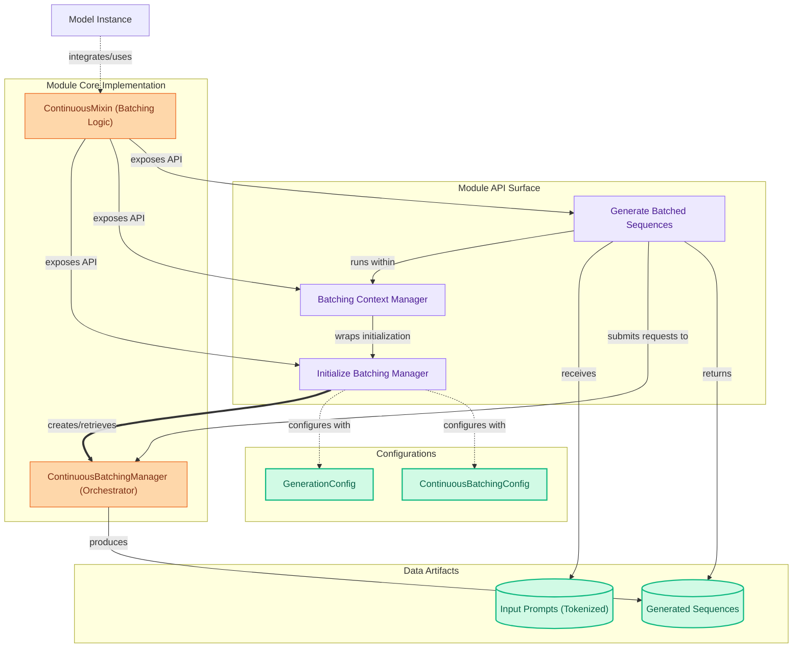

# Continuous Batching

This module provides a `ContinuousMixin` for models, enabling efficient continuous batching. It offers APIs to initialize a batching manager, manage inference contexts, and process prompt batches for optimized sequence generation.

<!-- DIAGRAM_JSON
{
    "direction": "TD",
    "nodes": [
        {
            "id": "model_instance",
            "label": "Model Instance",
            "type": "external",
            "link": null
        },
        {
            "id": "cb_mixin",
            "label": "ContinuousMixin (Batching Logic)",
            "type": "component",
            "link": null
        },
        {
            "id": "init_cb",
            "label": "Initialize Batching Manager",
            "type": "component",
            "link": null
        },
        {
            "id": "cb_context",
            "label": "Batching Context Manager",
            "type": "component",
            "link": null
        },
        {
            "id": "generate_batch",
            "label": "Generate Batched Sequences",
            "type": "component",
            "link": null
        },
        {
            "id": "cb_manager",
            "label": "ContinuousBatchingManager (Orchestrator)",
            "type": "component",
            "link": null
        },
        {
            "id": "gen_config",
            "label": "GenerationConfig",
            "type": "external",
            "link": null
        },
        {
            "id": "cb_config",
            "label": "ContinuousBatchingConfig",
            "type": "component",
            "link": null
        },
        {
            "id": "input_prompts",
            "label": "Input Prompts (Tokenized)",
            "type": "data",
            "link": null
        },
        {
            "id": "output_sequences",
            "label": "Generated Sequences",
            "type": "data",
            "link": null
        }
    ],
    "edges": [
        {
            "source": "model_instance",
            "target": "cb_mixin",
            "label": "integrates/uses"
        },
        {
            "source": "cb_mixin",
            "target": "init_cb",
            "label": "exposes API"
        },
        {
            "source": "cb_mixin",
            "target": "cb_context",
            "label": "exposes API"
        },
        {
            "source": "cb_mixin",
            "target": "generate_batch",
            "label": "exposes API"
        },
        {
            "source": "init_cb",
            "target": "cb_manager",
            "label": "creates/retrieves"
        },
        {
            "source": "init_cb",
            "target": "gen_config",
            "label": "configures with"
        },
        {
            "source": "init_cb",
            "target": "cb_config",
            "label": "configures with"
        },
        {
            "source": "cb_context",
            "target": "init_cb",
            "label": "wraps initialization"
        },
        {
            "source": "generate_batch",
            "target": "cb_context",
            "label": "runs within"
        },
        {
            "source": "generate_batch",
            "target": "input_prompts",
            "label": "receives"
        },
        {
            "source": "generate_batch",
            "target": "cb_manager",
            "label": "submits requests to"
        },
        {
            "source": "cb_manager",
            "target": "output_sequences",
            "label": "produces"
        },
        {
            "source": "generate_batch",
            "target": "output_sequences",
            "label": "returns"
        }
    ],
    "groups": [
        {
            "id": "module_api",
            "label": "Module API Surface",
            "role": "surface",
            "nodes": [
                "init_cb",
                "cb_context",
                "generate_batch"
            ]
        },
        {
            "id": "module_core_implementation",
            "label": "Module Core Implementation",
            "role": "generative",
            "nodes": [
                "cb_mixin",
                "cb_manager"
            ]
        },
        {
            "id": "data_artifacts_group",
            "label": "Data Artifacts",
            "role": "data",
            "nodes": [
                "input_prompts",
                "output_sequences"
            ]
        },
        {
            "id": "configurations_group",
            "label": "Configurations",
            "role": "data",
            "nodes": [
                "gen_config",
                "cb_config"
            ]
        }
    ]
}
-->
