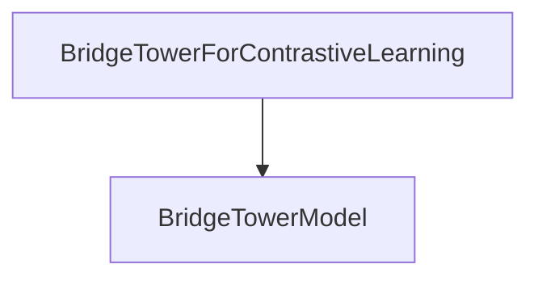

# Contrastive Learning Module

This module provides the `BridgeTowerForContrastiveLearning` model, which is specifically designed for contrastive learning tasks within the BridgeTower framework. It focuses on learning joint representations of image and text by maximizing the agreement between different views of the same data.

## Architecture and Core Functionality

The `contrastive_learning` module centers around the `BridgeTowerForContrastiveLearning` class. This class leverages the foundational `BridgeTowerModel` from the [bridgetower_models](bridgetower_models.md) module to process input modalities and then applies specialized contrastive heads to learn aligned embeddings for text, image, and cross-modal representations.

### BridgeTowerForContrastiveLearning

`src.transformers.models.bridgetower.modeling_bridgetower.BridgeTowerForContrastiveLearning`

This class is responsible for computing contrastive losses based on image and text inputs. It performs the following key steps:

1.  **Initialization**: It instantiates a `BridgeTowerModel` to handle the initial processing of image and text inputs. It also initializes three `BridgeTowerContrastiveHead` instances for text, image, and cross-modal embeddings, respectively, along with a learnable `logit_scale` parameter.
2.  **Forward Pass**: The `forward` method takes `input_ids`, `attention_mask`, `token_type_ids`, `pixel_values`, `pixel_mask`, `inputs_embeds`, and `image_embeds` as inputs. It first passes these through the internal `BridgeTowerModel` to obtain pooled outputs and hidden states.
3.  **Embedding Normalization**: It extracts the final hidden states for text and image, and the pooled output for the cross-modal representation. These are then passed through their respective `BridgeTowerContrastiveHead`s and L2-normalized to produce `text_embeds`, `image_embeds`, and `cross_embeds`.
4.  **Logit Calculation**: Similarity scores (logits) are computed between different pairs of embeddings: text-to-image, text-to-cross, and image-to-cross. The `logit_scale` parameter is applied to these scores.
5.  **Contrastive Loss**: If `return_loss` is `True`, an InfoNCE (softmax cross-entropy) loss is calculated for each pair of logits (text-to-image, text-to-cross, image-to-cross), and their average is returned as the overall `itc_loss`.
6.  **Output**: The method returns a `BridgeTowerContrastiveOutput` containing the calculated loss (if requested), the stacked logits, and the normalized text, image, and cross-modal embeddings.

## Module Relationships

This `contrastive_learning` module is a sub-module of the `bridgetower_models` module. It directly depends on the `BridgeTowerModel` provided by its parent module for initial multimodal feature extraction.

<!-- DIAGRAM_JSON
{
    "direction": "TD",
    "nodes": [
        {"id": "contrastive_learning", "label": "BridgeTowerForContrastiveLearning", "type": "component", "link": null},
        {"id": "bridgetower_model", "label": "BridgeTowerModel", "type": "external", "link": "bridgetower_models.md"}
    ],
    "edges": [
        {"source": "contrastive_learning", "target": "bridgetower_model"}
    ],
    "groups": []
}
-->
