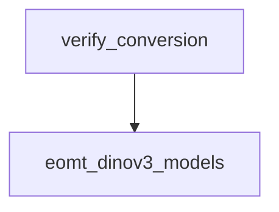

# `conversion_and_verification` Module Documentation

## Introduction

The `conversion_and_verification` module, specifically within the `eomt_dinov3_models` context, is responsible for verifying the correct conversion of EomtDinov3 models from their original implementation to the Hugging Face Transformers format. This module plays a critical role in ensuring the integrity and functional equivalence of converted models.

## Core Functionality

The primary functionality of this module is encapsulated in the `verify_conversion` function. This function performs a comprehensive comparison between an original EomtDinov3 model and its Hugging Face counterpart to detect any discrepancies arising during the conversion process.

### `verify_conversion`

```python
def verify_conversion(
    *,
    hf_model: EomtDinov3ForUniversalSegmentation,
    processor: EomtImageProcessorFast,
    delta_state_dict: dict[str, torch.Tensor],
    backbone_repo_id: str,
    image_size: int,
    original_repo_path: Path | None,
) -> None:
    # ... (code omitted for brevity)
```

This function takes the Hugging Face model (`hf_model`), its associated processor (`processor`), a `delta_state_dict` (presumably containing state differences or specific weights to load), `backbone_repo_id`, `image_size`, and the `original_repo_path` as input. It performs the following key steps:

1.  **Input Preparation**: Prepares a sample image using the provided `processor` and normalizes its pixel values.
2.  **Model Loading**: Loads the original model from the specified `original_repo_path` and initializes the Hugging Face model.
3.  **Output Collection**: Executes both the original and Hugging Face models with the prepared input to collect their respective outputs (e.g., patch embeddings, RoPE embeddings, hidden states, mask logits, class logits, and final sequence output).
4.  **Comparison and Verification**: Compares the outputs from both models using `torch.allclose` with specified absolute and relative tolerances. It calculates and prints the maximum absolute differences for various intermediate and final outputs.
5.  **Error Handling**: Raises a `ValueError` if any significant mismatches are detected between the original and converted model outputs, indicating a failed conversion.

This rigorous verification process ensures that the converted Hugging Face model accurately reproduces the behavior of the original model.

## Architecture and Component Relationships

The `conversion_and_verification` module is a leaf module focused on the verification process. Its main component, `verify_conversion`, depends on the model architecture and processing utilities provided by the `eomt_dinov3_models` module.

<!-- DIAGRAM_JSON
{
    "direction": "TD",
    "nodes": [
        {"id": "verify_conversion_func", "label": "verify_conversion", "type": "component", "link": null},
        {"id": "eomt_dinov3_models", "label": "eomt_dinov3_models", "type": "external", "link": "eomt_dinov3_models.md"}
    ],
    "edges": [
        {"source": "verify_conversion_func", "target": "eomt_dinov3_models"}
    ],
    "groups": []
}
-->



## How the Module Fits into the Overall System

This module is an integral part of the model conversion pipeline within the larger system. It acts as a quality gate, ensuring that any model converted to the Hugging Face format from its original implementation maintains functional parity. By providing a robust verification mechanism, it contributes to the reliability and trustworthiness of the converted models, making them suitable for use in downstream tasks and applications within the Hugging Face ecosystem. Its primary role is to prevent regressions and ensure consistency across different model implementations.