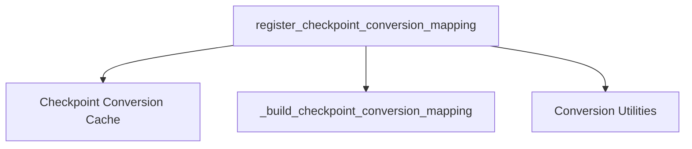

# conversion_registry

## Introduction

The `conversion_registry` module serves as a central registry for managing and applying checkpoint conversion mappings across various model types. Its primary purpose is to standardize the process of converting model checkpoints from one format or structure to another, ensuring compatibility and ease of integration within the system. This module is crucial for enabling seamless transitions when dealing with different model architectures or versions.

## Architecture

The `conversion_registry` module is designed to be a lightweight but critical component for managing model conversions. It exposes a simple API to register conversion mappings, which are then used by other parts of the system when a model checkpoint needs to be adapted. The core of its functionality revolves around an in-memory cache that stores these mappings, allowing for quick retrieval and application.

### Components

#### `register_checkpoint_conversion_mapping`

This is the primary function of the `conversion_registry` module. It allows external modules to register a specific conversion mapping for a given `model_type`. The function takes the `model_type` (a string identifier), a `mapping` (a list of `WeightConverter` or `WeightRenaming` objects), and an optional `overwrite` flag. If `overwrite` is `False` and a mapping for the `model_type` already exists, a `ValueError` is raised to prevent accidental overwrites.

The `mapping` parameter represents the actual logic for converting the weights of a model. The types `WeightConverter` and `WeightRenaming` are expected to be defined in a utility module, likely the [conversion_utilities](conversion_utilities.md) module.

### Relationships

-   The `register_checkpoint_conversion_mapping` function initializes `_checkpoint_conversion_mapping_cache` if it's `None` by calling `_build_checkpoint_conversion_mapping()`.
-   The `register_checkpoint_conversion_mapping` function populates and interacts with the `_checkpoint_conversion_mapping_cache`.
-   The module relies on external types like `WeightConverter` and `WeightRenaming`, which are likely provided by the [conversion_utilities](conversion_utilities.md) module.

## Module Integration

The `conversion_registry` module plays a vital role in any part of the system that needs to load or adapt model checkpoints. This typically includes model loading utilities, fine-tuning scripts, or inference pipelines that might work with models originating from different frameworks or versions. By centralizing the conversion logic, it ensures consistency and reduces boilerplate code across various model integrations. Other modules that might interact with this registry include various model-specific conversion utilities found under sub-modules of `maskformer_models` like `general_model_converters` and `maskformer_converters`.

<!-- DIAGRAM_JSON
{
    "direction": "TD",
    "nodes": [
        {"id": "register_checkpoint_conversion_mapping", "label": "register_checkpoint_conversion_mapping", "type": "component", "link": null},
        {"id": "_checkpoint_conversion_mapping_cache", "label": "Checkpoint Conversion Cache", "type": "component", "link": null},
        {"id": "_build_checkpoint_conversion_mapping", "label": "_build_checkpoint_conversion_mapping", "type": "component", "link": null},
        {"id": "conversion_utilities", "label": "Conversion Utilities", "type": "external", "link": "conversion_utilities.md"}
    ],
    "edges": [
        {"source": "register_checkpoint_conversion_mapping", "target": "_checkpoint_conversion_mapping_cache"},
        {"source": "register_checkpoint_conversion_mapping", "target": "_build_checkpoint_conversion_mapping"},
        {"source": "register_checkpoint_conversion_mapping", "target": "conversion_utilities"}
    ],
    "groups": []
}
-->

