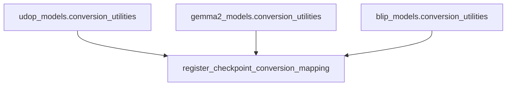

# `conversion_utilities` Module Documentation

## Introduction

The `conversion_utilities` module serves as a foundational component within the system, providing a standardized framework for converting model checkpoints from various external sources into a consistent internal format, typically compatible with the Hugging Face Transformers library. Its primary goal is to simplify and streamline the integration of diverse pre-trained models, ensuring interoperability and ease of use across the ecosystem.

## Core Functionality

The central piece of this module is the `register_checkpoint_conversion_mapping` mechanism. This utility enables developers to register specific conversion functions for different model architectures. By doing so, it creates a registry that the system can query to find the appropriate conversion logic for any given model checkpoint.

### `register_checkpoint_conversion_mapping`

This function (or a decorator performing a similar role) allows a clean and organized way to associate a model's unique identifier or type with a dedicated function responsible for transforming its original checkpoint structure into the Hugging Face format. This promotes a plug-and-play approach, making it easy to add support for new models without modifying core system logic.

**Example of a model-specific conversion function (Conceptual, based on `convert_udop_checkpoint`):**

While `register_checkpoint_conversion_mapping` is the general mechanism, concrete conversion logic resides in model-specific `conversion_utilities` sub-modules. For instance, the `udop_models.conversion_utilities` submodule contains a function like `convert_udop_checkpoint`. This function handles:

1.  **Loading Original Checkpoints**: Retrieves the model's original state dictionary from a specified path.
2.  **Hugging Face Model Initialization**: Instantiates the corresponding Hugging Face model (`UdopForConditionalGeneration` in the UDOP example) and its configuration.
3.  **Key Renaming and Weight Loading**: Adjusts the keys in the original state dictionary to match the Hugging Face model's expected parameter names and loads the weights.
4.  **Processor and Tokenizer Setup**: Initializes and configures the necessary tokenizer (`UdopTokenizer`) and image processor (`LayoutLMv3ImageProcessor`) components.
5.  **Verification**: Includes steps to verify the conversion by performing dummy forward passes and autoregressive decoding to ensure functional correctness.
6.  **Saving and Pushing**: Provides options to save the converted model and processor locally or upload them directly to the Hugging Face Hub.

## Architecture and Component Relationships

The `conversion_utilities` module acts as a central hub for managing model conversions. It doesn't directly perform the conversions for every model, but rather provides the infrastructure for registering and invoking model-specific conversion routines.

Model-specific `conversion_utilities` sub-modules (e.g., within `udop_models`, `gemma2_models`, `blip_models`) contain the actual implementation details for converting a particular model architecture. These sub-modules leverage the registration mechanism provided by the top-level `conversion_utilities` to make their conversion functions discoverable and usable by the broader system.

<!-- DIAGRAM_JSON
{
    "direction": "TD",
    "nodes": [
        {"id": "register_conversion", "label": "register_checkpoint_conversion_mapping", "type": "component", "link": null},
        {"id": "udop_conv_utils", "label": "udop_models.conversion_utilities", "type": "external", "link": "udop_models.md"},
        {"id": "gemma2_conv_utils", "label": "gemma2_models.conversion_utilities", "type": "external", "link": "gemma2_models.md"},
        {"id": "blip_conv_utils", "label": "blip_models.conversion_utilities", "type": "external", "link": "blip_models.md"}
    ],
    "edges": [
        {"source": "udop_conv_utils", "target": "register_conversion"},
        {"source": "gemma2_conv_utils", "target": "register_conversion"},
        {"source": "blip_conv_utils", "target": "register_conversion"}
    ],
    "groups": []
}
-->

## How the Module Fits into the Overall System

The `conversion_utilities` module is crucial for maintaining and expanding the vast array of models supported by the system. It acts as an integration layer, allowing new models developed in different frameworks or with unique checkpoint structures to be seamlessly brought into the Hugging Face ecosystem.

By centralizing the registration process, it ensures that model loading and conversion logic is consistent and easily discoverable. This facilitates rapid development and deployment of new models, making the entire system more flexible and adaptable to evolving research and industry standards. It underpins the ability of the system to provide a unified API for a diverse collection of models, regardless of their original training framework.