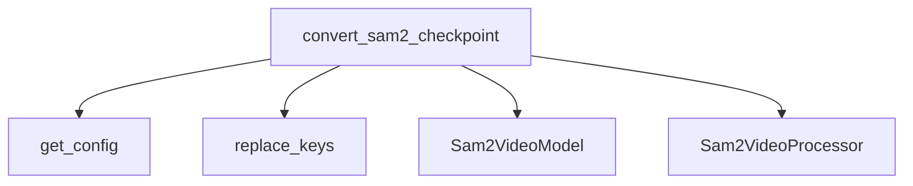

The `conversion_utility` module within the `sam2_video_models` package is responsible for facilitating the conversion of pre-trained SAM-2 video model checkpoints into a format compatible with the Hugging Face Transformers library. This module ensures that models trained externally can be easily integrated, utilized, and shared within the Hugging Face ecosystem.

### Purpose and Core Functionality

The primary purpose of this module is to provide a robust and verifiable method for converting SAM-2 video model checkpoints. Its core functionality revolves around the `convert_sam2_checkpoint` function, which performs the following key operations:

1.  **Configuration Loading**: Retrieves the appropriate model configuration based on the provided `model_name`.
2.  **State Dictionary Processing**: Loads the raw checkpoint state dictionary and applies necessary key replacements to align with Hugging Face's naming conventions.
3.  **Processor and Model Initialization**: Initializes the `Sam2ImageProcessorFast`, `Sam2VideoVideoProcessor`, and `Sam2VideoProcessor` (from the `sam2_video_models` module) as well as the `Sam2VideoModel` with the loaded configuration.
4.  **State Dictionary Loading**: Loads the processed state dictionary into the Hugging Face model, with strict checking to identify any missing or unexpected keys.
5.  **Sanity Check**: Executes a forward pass with a sample image and predefined input points/labels to verify that the converted model produces expected IoU scores, ensuring the conversion was successful.
6.  **Saving and Pushing**: Optionally saves the converted processor and model to a specified local folder or pushes them directly to the Hugging Face Hub.

### Architecture and Component Relationships

The `conversion_utility` module is a leaf module dedicated to the conversion process. It relies heavily on components defined within its parent `sam2_video_models` module, particularly the `Sam2VideoModel` for the model architecture and the `Sam2VideoProcessor` for handling input data.

<!-- DIAGRAM_JSON
{
    "direction": "TD",
    "nodes": [
        {"id": "convert_sam2_checkpoint", "label": "convert_sam2_checkpoint", "type": "component", "link": null},
        {"id": "get_config", "label": "get_config", "type": "component", "link": null},
        {"id": "replace_keys", "label": "replace_keys", "type": "component", "link": null},
        {"id": "sam2_video_model", "label": "Sam2VideoModel", "type": "external", "link": "sam2_video_models.md"},
        {"id": "sam2_video_processor", "label": "Sam2VideoProcessor", "type": "external", "link": "sam2_video_models.md"}
    ],
    "edges": [
        {"source": "convert_sam2_checkpoint", "target": "get_config"},
        {"source": "convert_sam2_checkpoint", "target": "replace_keys"},
        {"source": "convert_sam2_checkpoint", "target": "sam2_video_model"},
        {"source": "convert_sam2_checkpoint", "target": "sam2_video_processor"}
    ],
    "groups": []
}
-->

### How the Module Fits into the Overall System

The `conversion_utility` module serves as a critical bridge between externally trained SAM-2 video model weights and their usability within the Hugging Face Transformers library. By providing a dedicated conversion mechanism, it enables:

*   **Interoperability**: Allows researchers and developers to leverage pre-trained SAM-2 video models from various sources within a standardized Hugging Face environment.
*   **Ecosystem Integration**: Facilitates the seamless use of SAM-2 video models with other Hugging Face tools, pipelines, and datasets.
*   **Model Sharing**: Supports the effortless sharing and deployment of converted models on the Hugging Face Hub.

This module is a vital part of the `sam2_video_models` package, ensuring that the model's capabilities can be fully realized and disseminated within the broader machine learning community. It directly depends on the core model and processor implementations found in the main [sam2_video_models](sam2_video_models.md) module to perform its conversion tasks.