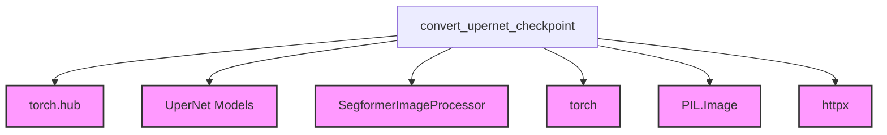

# convnext_conversion

## Introduction
The `convnext_conversion` module is responsible for converting pre-trained ConvNeXt UperNet model checkpoints from external sources (e.g., OpenMMLab) into a PyTorch-compatible format suitable for the Hugging Face Transformers library. This module facilitates the integration of ConvNeXt-based UperNet models, ensuring their usability within the broader ecosystem.

## Comprehensive Documentation

### Purpose and Core Functionality
The primary purpose of the `convnext_conversion` module is to provide a robust and verifiable method for converting UperNet models that use ConvNeXt as their backbone. The core functionality is encapsulated within the `convert_upernet_checkpoint` function, which performs the following key steps:
1.  **Checkpoint Loading:** Fetches pre-trained model weights from specified URLs (e.g., OpenMMLab).
2.  **Configuration and Model Initialization:** Initializes the `UperNetForSemanticSegmentation` model with a suitable configuration.
3.  **State Dictionary Transformation:** Renames keys in the loaded state dictionary to align with the PyTorch model's expected parameter names, handling common discrepancies like "bn" to "batch_norm".
4.  **Model Loading:** Loads the transformed state dictionary into the PyTorch `UperNetForSemanticSegmentation` model.
5.  **Verification:** Performs an inference pass with a sample image and asserts the output logits against expected values, ensuring the conversion was successful and the model behaves as anticipated.
6.  **Saving and Pushing to Hub:** Optionally saves the converted model and its associated image processor to a local folder and/or pushes them to the Hugging Face Model Hub.

### Architecture and Component Relationships
The `convnext_conversion` module, specifically the `convert_upernet_checkpoint` function, interacts with several internal and external components to achieve its conversion goal.

<!-- DIAGRAM_JSON
{
    "direction": "TD",
    "nodes": [
        {"id": "convert_upernet_checkpoint", "label": "convert_upernet_checkpoint", "type": "component", "link": null},
        {"id": "upernet_models", "label": "UperNet Models", "type": "external", "link": "upernet_models.md"},
        {"id": "segformer_image_processor", "label": "SegformerImageProcessor", "type": "external", "link": null},
        {"id": "torch_hub", "label": "torch.hub", "type": "external", "link": null},
        {"id": "torch", "label": "torch", "type": "external", "link": null},
        {"id": "pil_image", "label": "PIL.Image", "type": "external", "link": null},
        {"id": "httpx", "label": "httpx", "type": "external", "link": null}
    ],
    "edges": [
        {"source": "convert_upernet_checkpoint", "target": "torch_hub"},
        {"source": "convert_upernet_checkpoint", "target": "upernet_models"},
        {"source": "convert_upernet_checkpoint", "target": "segformer_image_processor"},
        {"source": "convert_upernet_checkpoint", "target": "torch"},
        {"source": "convert_upernet_checkpoint", "target": "pil_image"},
        {"source": "convert_upernet_checkpoint", "target": "httpx"}
    ],
    "groups": []
}
-->

**Key Relationships:**
*   `convert_upernet_checkpoint` (Internal Component): This is the central function of the module, orchestrating the entire conversion process.
*   `upernet_models` (External Dependency): The `convert_upernet_checkpoint` function depends on the model architecture defined in the `upernet_models` module, specifically the `UperNetForSemanticSegmentation` class and configuration retrieval functions (`get_upernet_config`). For more details, refer to the [upernet_models documentation](upernet_models.md).
*   `SegformerImageProcessor` (External Dependency): Used for pre-processing input images before model inference for verification. While its source module isn't explicitly defined in the provided tree, it's a standard image processing component.
*   `torch.hub` and `torch` (External Dependencies): Utilized for loading state dictionaries and tensor operations, respectively.
*   `PIL.Image` and `httpx` (External Dependencies): Used for fetching and processing sample images for verification.

### How the module fits into the overall system
The `convnext_conversion` module is a sub-module of `upernet_models`, playing a critical role in expanding the range of pre-trained models available for UperNet. It acts as a bridge, enabling the use of ConvNeXt-based UperNet models within the Hugging Face Transformers framework. By providing a verified conversion path, it ensures that models trained in other ecosystems can be seamlessly integrated, lowering the barrier to entry for developers and researchers who wish to leverage these powerful architectures. Its placement under `upernet_models` signifies its specialized function in preparing UperNet checkpoints for use with the existing UperNet model implementations.
