# convnextv2_models

The `convnextv2_models` module is responsible for converting pre-trained ConvNeXTV2 model checkpoints from their original format to a PyTorch-compatible format, suitable for use within the Hugging Face Transformers library. This module facilitates the integration of ConvNeXTV2 models by handling weight conversion, configuration mapping, and initial model testing.

## Core Functionality

The primary functionality of this module revolves around the `convert_convnextv2_checkpoint` function. This function takes an original ConvNeXTV2 model checkpoint URL, converts its weights, loads them into a Hugging Face `ConvNextV2ForImageClassification` model, and verifies the model's outputs against expected values. It also handles saving the converted model and its associated preprocessor, with an option to push them to the Hugging Face Hub.

## Architecture and Component Relationships

The following diagram illustrates the internal components of the `convnextv2_models` module and its relationships with external dependencies.

<!-- DIAGRAM_JSON
{
    "direction": "TD",
    "nodes": [
        {"id": "convert_checkpoint_func", "label": "convert_convnextv2_checkpoint", "type": "component", "link": null},
        {"id": "get_config_func", "label": "get_convnextv2_config", "type": "component", "link": null},
        {"id": "rename_key_func", "label": "rename_key", "type": "component", "link": null},
        {"id": "convert_preprocessor_func", "label": "convert_preprocessor", "type": "component", "link": null},
        {"id": "prepare_img_func", "label": "prepare_img", "type": "component", "link": null},
        {"id": "modeling_utils_module", "label": "Modeling Utilities", "type": "external", "link": "modeling_utilities.md"},
        {"id": "image_utils_module", "label": "Image Utilities", "type": "external", "link": "image_utilities.md"},
        {"id": "torch_lib", "label": "PyTorch Library", "type": "external", "link": null},
        {"id": "os_lib", "label": "OS Module", "type": "external", "link": null},
        {"id": "huggingface_hub_lib", "label": "Hugging Face Hub", "type": "external", "link": null}
    ],
    "edges": [
        {"source": "convert_checkpoint_func", "target": "get_config_func"},
        {"source": "convert_checkpoint_func", "target": "rename_key_func"},
        {"source": "convert_checkpoint_func", "target": "convert_preprocessor_func"},
        {"source": "convert_checkpoint_func", "target": "prepare_img_func"},
        {"source": "convert_checkpoint_func", "target": "modeling_utils_module"},
        {"source": "convert_checkpoint_func", "target": "image_utils_module"},
        {"source": "convert_checkpoint_func", "target": "torch_lib"},
        {"source": "convert_checkpoint_func", "target": "os_lib"},
        {"source": "convert_checkpoint_func", "target": "huggingface_hub_lib"}
    ],
    "groups": []
}
-->

```mermaid
graph TD
    convert_checkpoint_func[convert_convnextv2_checkpoint]
    get_config_func[get_convnextv2_config]
    rename_key_func[rename_key]
    convert_preprocessor_func[convert_preprocessor]
    prepare_img_func[prepare_img]
    modeling_utils_module[Modeling Utilities]:::external_link
    image_utils_module[Image Utilities]:::external_link
    torch_lib[PyTorch Library]
    os_lib[OS Module]
    huggingface_hub_lib[Hugging Face Hub]

    convert_checkpoint_func --> get_config_func
    convert_checkpoint_func --> rename_key_func
    convert_checkpoint_func --> convert_preprocessor_func
    convert_checkpoint_func --> prepare_img_func
    convert_checkpoint_func --> modeling_utils_module
    convert_checkpoint_func --> image_utils_module
    convert_checkpoint_func --> torch_lib
    convert_checkpoint_func --> os_lib
    convert_checkpoint_func --> huggingface_hub_lib

    linkStyle 5 stroke:#333,stroke-width:2px;
    linkStyle 6 stroke:#333,stroke-width:2px;
    classDef external_link fill:#f9f,stroke:#333,stroke-width:2px;
```

### Core Components

#### `convert_convnextv2_checkpoint`
- **Location:** `src/transformers/models/convnextv2/convert_convnextv2_to_pytorch.py`
- **Purpose:** This function is the orchestrator of the conversion process. It performs the following key operations:
    1. **Downloads Original Checkpoint:** Fetches the pre-trained ConvNeXTV2 model checkpoint from a specified URL.
    2. **Configuration Definition:** Infers the model configuration and expected output shape based on the checkpoint URL using `get_convnextv2_config`.
    3. **Weight Renaming:** Renames the keys in the original state dictionary to match the Hugging Face model's expected naming conventions using `rename_key`.
    4. **Model Instantiation and Loading:** Initializes a `ConvNextV2ForImageClassification` model (part of the [Modeling Utilities](modeling_utilities.md)) and loads the converted state dictionary.
    5. **Preprocessor Conversion:** Converts the original model's image preprocessor into a Hugging Face `ConvNextImageProcessor` using `convert_preprocessor` (which relies on [Image Utilities](image_utilities.md)).
    6. **Output Verification:** Prepares a dummy image using `prepare_img` and runs it through the converted model and preprocessor to verify that the outputs (logits) match expected values, ensuring the conversion was successful.
    7. **Saving and Pushing:** Optionally saves the converted model and preprocessor to a local directory and pushes them to the Hugging Face Hub.

## How the Module Fits into the Overall System

The `convnextv2_models` module plays a crucial role in expanding the Hugging Face Transformers library's compatibility by enabling the seamless integration of ConvNeXTV2 models. It acts as a bridge, allowing researchers and developers to leverage pre-trained ConvNeXTV2 models within the Hugging Face ecosystem. This module depends on general [Modeling Utilities](modeling_utilities.md) for model definition and [Image Utilities](image_utilities.md) for image preprocessing, ensuring consistency and reusability across different vision models. It also utilizes the PyTorch library for core tensor operations and the Hugging Face Hub for model sharing and versioning.
