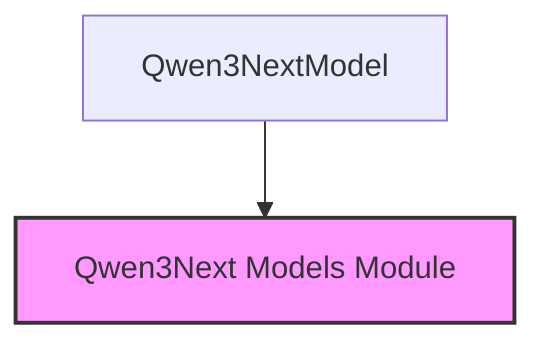

# `core_architecture` Module Documentation

The `core_architecture` module provides the foundational model architecture for the Qwen3Next family of models. It encapsulates the core components necessary for constructing a large language model, focusing on efficient token embedding, layered decoding with attention mechanisms, normalization, and positional embeddings.

## Core Functionality

The primary component within this module is `Qwen3NextModel`. This class orchestrates the forward pass of the Qwen3Next model, processing input tokens through a series of decoder layers.

Key functionalities include:
*   **Token Embedding**: Converts input token IDs into dense vector representations.
*   **Layered Decoding**: Utilizes multiple `Qwen3NextDecoderLayer` instances to process sequences, applying self-attention and feed-forward networks.
*   **Rotary Positional Embeddings**: Incorporates positional information into the attention mechanism using `Qwen3NextRotaryEmbedding`.
*   **Root Mean Square Normalization (RMSNorm)**: Applies normalization across hidden states to stabilize training.
*   **Attention Masking**: Dynamically generates and updates causal and linear attention masks based on the input and cached key-value states.
*   **Cache Management**: Supports `past_key_values` for efficient sequential generation.

The `forward` method is the central entry point, handling input validation, mask generation, and the iterative processing through decoder layers. It ensures that the model can operate in both training and inference modes, with support for caching intermediate states to accelerate generation.

## Architecture and Component Relationships

The `core_architecture` module, specifically the `Qwen3NextModel`, depends on several key components and utilities provided by the broader `qwen3_next_models` module.

<!-- DIAGRAM_JSON
{
    "direction": "TD",
    "nodes": [
        {"id": "qwen3_next_model_class", "label": "Qwen3NextModel", "type": "component", "link": null},
        {"id": "qwen3_next_models_module", "label": "Qwen3Next Models Module", "type": "external", "link": "qwen3_next_models.md"}
    ],
    "edges": [
        {"source": "qwen3_next_model_class", "target": "qwen3_next_models_module"}
    ],
    "groups": []
}
-->

The `Qwen3NextModel` class internally comprises:
*   An `nn.Embedding` layer (`self.embed_tokens`) for converting input token IDs to embeddings.
*   A `nn.ModuleList` of `Qwen3NextDecoderLayer` instances (`self.layers`) which are the main computational blocks for transforming hidden states.
*   A `Qwen3NextRMSNorm` instance (`self.norm`) applied to the final hidden states.
*   A `Qwen3NextRotaryEmbedding` instance (`self.rotary_emb`) for computing positional embeddings.

These constituent classes (`Qwen3NextConfig`, `Qwen3NextPreTrainedModel`, `Qwen3NextDecoderLayer`, `Qwen3NextRMSNorm`, `Qwen3NextRotaryEmbedding`, and utility functions like `create_causal_mask`) are defined within the `qwen3_next_models` module or its related utilities and are crucial for the proper functioning of `Qwen3NextModel`.

## How the module fits into the overall system

The `core_architecture` module serves as the backbone for any Qwen3Next-based model. It provides the fundamental neural network structure, handling the intricate details of token processing, attention mechanisms, and normalization. Other modules within the `qwen3_next_models` family, such as `causal_lm_model`, would build upon this core architecture by adding specific heads or functionalities required for tasks like causal language modeling. Essentially, `core_architecture` defines "what a Qwen3Next model *is*," allowing other modules to define "what a Qwen3Next model *does* for a specific task."