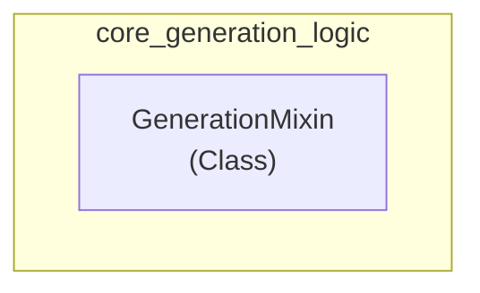

# core_generation_logic
This module provides `GenerationMixin`, a class designed to be mixed into model classes to enable auto-regressive text generation capabilities and related automation. It exposes methods like `generate` for various decoding strategies.

<!-- DIAGRAM_JSON
{
  "nodes": [
    {
      "id": "core_generation_logic",
      "label": "core_generation_logic",
      "type": "Module"
    },
    {
      "id": "GenerationMixin",
      "label": "GenerationMixin",
      "type": "Class"
    }
  ],
  "edges": [
    {
      "source": "core_generation_logic",
      "target": "GenerationMixin",
      "label": "contains",
      "type": "Contains"
    }
  ],
  "groups": [
    {
      "id": "core_generation_logic_group",
      "label": "core_generation_logic",
      "nodes": ["GenerationMixin"]
    }
  ]
}
-->
