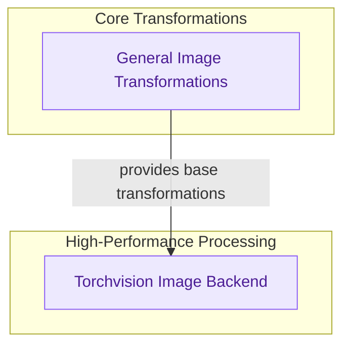

# Core Image Utilities
This module provides essential utilities for image processing, offering both GPU-accelerated batched operations via Torchvision and general-purpose transformations like format conversion, resizing, and normalization for diverse image handling requirements.

<!-- DIAGRAM_JSON
{
    "direction": "TD",
    "nodes": [
        {"id": "image_processing_backend", "label": "Torchvision Image Backend", "type": "module", "link": "image_processing_backend.md"},
        {"id": "image_transformation_utilities", "label": "General Image Transformations", "type": "module", "link": "image_transformation_utilities.md"}
    ],
    "edges": [
        {"source": "image_transformation_utilities", "target": "image_processing_backend", "label": "provides base transformations"}
    ],
    "groups": [
        {"id": "core_transformations", "label": "Core Transformations", "role": "analytical", "nodes": ["image_transformation_utilities"]},
        {"id": "high_performance_processing", "label": "High-Performance Processing", "role": "analytical", "nodes": ["image_processing_backend"]}
    ]
}
-->
