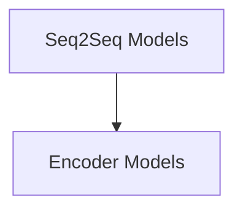

# Core Modeling Module

## Introduction and Purpose

The `core_modeling` module serves as the foundational component for implementing Switch Transformers models. It provides the core encoder-decoder architectures, including specialized models for conditional generation and encoder-only tasks. This module is critical for handling the Mixture-of-Experts (MoE) routing and loss computation within these models.

## Architecture Overview

The Switch Transformers architecture primarily consists of an encoder-decoder structure, leveraging a shared embedding layer. The module encapsulates the logic for both the encoder and decoder stacks, enabling flexible model configurations. A key feature is the integration of Mixture-of-Experts (MoE) layers, allowing for dynamic routing of tokens to different experts, thereby enhancing model capacity and efficiency.

The module is structured into two main logical sub-modules:

- **Encoder Models**: Focuses on the encoder-only implementations of the Switch Transformers.
- **Seq2Seq Models**: Encompasses the full encoder-decoder models, including variants for conditional generation.

<!-- DIAGRAM_JSON
{
    "direction": "TD",
    "nodes": [
        {"id": "encoder_models", "label": "Encoder Models", "type": "module", "link": "encoder_models.md"},
        {"id": "seq2seq_models", "label": "Seq2Seq Models", "type": "module", "link": "seq2seq_models.md"}
    ],
    "edges": [
        {"source": "seq2seq_models", "target": "encoder_models", "label": "utilizes"}
    ],
    "groups": []
}
-->

## Sub-module Functionality

### [Encoder Models](encoder_models.md)
This sub-module provides the `SwitchTransformersEncoderModel`, which is responsible for processing input sequences using the Switch Transformer encoder stack. It is designed for tasks that primarily require encoding information, without an explicit decoding phase.

### [Seq2Seq Models](seq2seq_models.md)
This sub-module includes the `SwitchTransformersModel` and `SwitchTransformersForConditionalGeneration`. These models implement the full encoder-decoder architecture of Switch Transformers. `SwitchTransformersModel` serves as the base sequence-to-sequence model, while `SwitchTransformersForConditionalGeneration` extends this with a language modeling head for conditional text generation tasks, incorporating router loss calculations for MoE layers.
