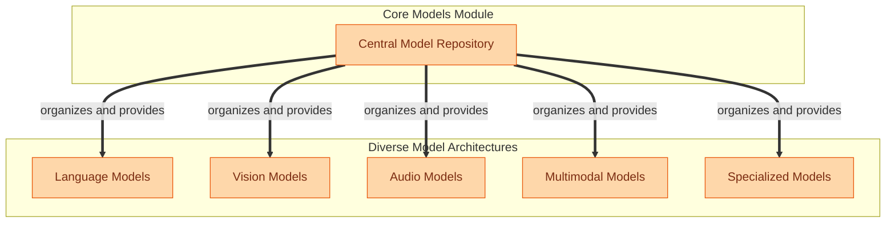

The `core_models` module serves as the central repository for a vast collection of pre-trained model architectures across various modalities and specialized tasks within the `transformers` library. Its primary purpose is to provide users with ready-to-use implementations of state-of-the-art models for natural language processing, computer vision, audio processing, multimodal understanding, and other domain-specific applications.

This module enables users to easily load, fine-tune, and deploy complex neural network models, abstracting away the intricate details of their underlying architectures. By centralizing these implementations, `core_models` facilitates rapid experimentation and application development across a wide spectrum of AI tasks.

### How the Module's Components Work Together

The `core_models` module organizes its extensive collection of models into distinct categories based on their primary modality or application. This structure allows for logical grouping and efficient access to specific model types.

The `Central Model Repository` acts as the entry point, offering a unified interface to access the various model categories. Each category, such as `Language Models` or `Vision Models`, encapsulates a set of specific model implementations tailored for tasks within that domain. This modular design ensures that users can easily navigate and select the appropriate model for their needs, while maintaining a clear separation of concerns across different AI disciplines.

### Core Components Documentation

- **Language Models**: [src/transformers/models/language_models](language_models.md)
- **Vision Models**: [src/transformers/models/vision_models](vision_models.md)
- **Audio Models**: [src/transformers/models/audio_models](audio_models.md)
- **Multimodal Models**: [src/transformers/models/multimodal_models](multimodal_models.md)
- **Specialized Models**: [src/transformers/models/specialized_models](specialized_models.md)