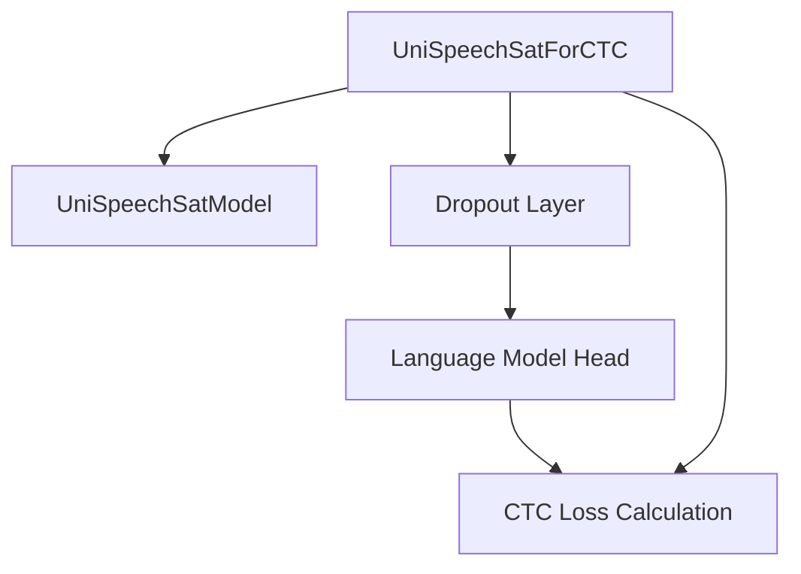

# ctc_decoding Module Documentation

## Introduction

The `ctc_decoding` module provides the Connectionist Temporal Classification (CTC) head specifically designed for the UniSpeechSat model. Its primary function is to enable end-to-end speech recognition by computing the CTC loss during training and generating logits for decoding during inference. This module integrates seamlessly with the core UniSpeechSat model to convert audio features into a sequence of predicted tokens.

## Architecture and Component Relationships

This module's core functionality is encapsulated within the `UniSpeechSatForCTC` class, which extends the `UniSpeechSatPreTrainedModel`. It leverages the base `UniSpeechSatModel` to extract features and then applies a linear layer to project these features into a vocabulary space, followed by CTC loss calculation.

<!-- DIAGRAM_JSON
{
    "direction": "TD",
    "nodes": [
        {"id": "unispeech_sat_for_ctc", "label": "UniSpeechSatForCTC", "type": "component", "link": null},
        {"id": "unispeech_sat_model", "label": "UniSpeechSatModel", "type": "external", "link": "unispeech_sat_models.md"},
        {"id": "dropout_layer", "label": "Dropout Layer", "type": "component", "link": null},
        {"id": "lm_head", "label": "Language Model Head", "type": "component", "link": null},
        {"id": "ctc_loss_logic", "label": "CTC Loss Calculation", "type": "component", "link": null}
    ],
    "edges": [
        {"source": "unispeech_sat_for_ctc", "target": "unispeech_sat_model"},
        {"source": "unispeech_sat_for_ctc", "target": "dropout_layer"},
        {"source": "dropout_layer", "target": "lm_head"},
        {"source": "lm_head", "target": "ctc_loss_logic"},
        {"source": "unispeech_sat_for_ctc", "target": "ctc_loss_logic"}
    ],
    "groups": []
}
-->

### Core Components

#### `UniSpeechSatForCTC`

- **Purpose**: This is the main class in the `ctc_decoding` module, responsible for applying a CTC head on top of the UniSpeechSat model's hidden states. It is designed for speech-to-text tasks where the output is a sequence of tokens without explicit alignment.
- **Key Features**:
    - **Initialization**: Takes a configuration object (`config`) and an optional `target_lang` for adapter weights. It initializes the base `UniSpeechSatModel`, a dropout layer, and a linear language model head (`lm_head`).
    - **`tie_weights`**: Overrides the base method to facilitate the loading of language-specific adapter weights, allowing for multilingual fine-tuning or inference.
    - **`freeze_feature_encoder()`**: Provides a utility method to disable gradient computation for the feature encoder part of the underlying `UniSpeechSatModel`, useful for transfer learning scenarios where the feature extractor is pre-trained and should remain static.
    - **`freeze_base_model()`**: Disables gradient computation for the entire `UniSpeechSatModel`, allowing only the `lm_head` to be updated during training.
    - **`forward()` Method**: 
        - Processes `input_values` through the `UniSpeechSatModel` to obtain hidden states.
        - Applies dropout to the hidden states.
        - Passes the processed hidden states through the `lm_head` to generate `logits` over the vocabulary.
        - If `labels` are provided, it computes the CTC loss using `torch.nn.functional.ctc_loss`, handling input lengths, target lengths, and padding masks. The loss is computed in float32 for stability.
        - Returns `logits` and optionally the `loss`, `hidden_states`, and `attentions` in a `CausalLMOutput` object or a tuple.
- **Dependencies**:
    - Inherits from `UniSpeechSatPreTrainedModel`.
    - Relies on `UniSpeechSatModel` (documented in [unispeech_sat_models.md](unispeech_sat_models.md)) for core feature extraction and contextual representations.
    - Uses standard PyTorch modules like `torch.nn.Dropout` and `torch.nn.Linear`.
    - Employs `torch.nn.functional.ctc_loss` for loss computation.

## Integration with the Overall System

The `ctc_decoding` module serves as a specialized output head within the broader `unispeech_sat_models` ecosystem. It enables `UniSpeechSat` models to perform Automatic Speech Recognition (ASR) tasks directly using the CTC objective. By providing `UniSpeechSatForCTC`, the system allows for:

- **Speech-to-Text Fine-tuning**: Users can fine-tune a pre-trained `UniSpeechSatModel` for ASR tasks, with the `ctc_decoding` module handling the final classification and loss calculation.
- **Multilingual ASR**: The `target_lang` parameter and adapter loading mechanism support adapting the model to different languages without full retraining.
- **Flexible Training**: The `freeze_feature_encoder` and `freeze_base_model` methods offer granular control over which parts of the model are updated during training, facilitating various transfer learning strategies.

This module is critical for any application requiring the `UniSpeechSat` model to output sequences of tokens from speech input, forming a key component in a complete ASR pipeline.