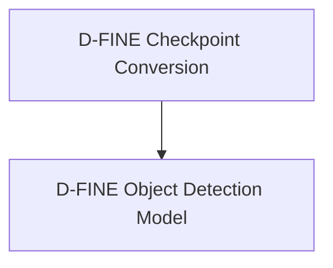

# D-FINE Models Documentation

## Introduction
The `d_fine_models` module encompasses the implementation and conversion utilities for the D-FINE object detection models within the Transformers library. It provides the necessary tools for converting original PyTorch checkpoints to the Hugging Face format and the core model architecture for performing object detection tasks.

## Architecture Overview
The `d_fine_models` module is composed of two primary sub-modules:
- **Conversion Scripts**: Responsible for handling the conversion of pre-trained D-FINE model weights from their original format to the Hugging Face compatible format.
- **Object Detection Model**: Defines the `DFineForObjectDetection` class, which is the main model architecture for performing object detection.

These sub-modules work in conjunction to enable the use of D-FINE models within the Hugging Face ecosystem, allowing for easy loading, inference, and fine-tuning.

<!-- DIAGRAM_JSON
{
    "direction": "TD",
    "nodes": [
        {"id": "conversion_scripts", "label": "D-FINE Checkpoint Conversion", "type": "module", "link": "conversion_scripts.md"},
        {"id": "object_detection_model", "label": "D-FINE Object Detection Model", "type": "module", "link": "object_detection_model.md"}
    ],
    "edges": [
        {"source": "conversion_scripts", "target": "object_detection_model"}
    ],
    "groups": []
}
-->

## High-Level Functionality

### [D-FINE Checkpoint Conversion](conversion_scripts.md)
This sub-module contains scripts to facilitate the conversion of D-FINE model checkpoints from their original PyTorch format to the Hugging Face Transformers format. This includes handling weight remapping, managing specific model configurations, and ensuring compatibility for loading and using the models within the Hugging Face environment.

### [D-FINE Object Detection Model](object_detection_model.md)
This sub-module defines the `DFineForObjectDetection` class, which is the primary model used for object detection. It encapsulates the D-FINE encoder-decoder architecture, manages the class and bounding box prediction heads, and provides the forward pass logic for inference and training. It also includes methods for post-processing model outputs into standard object detection formats.
