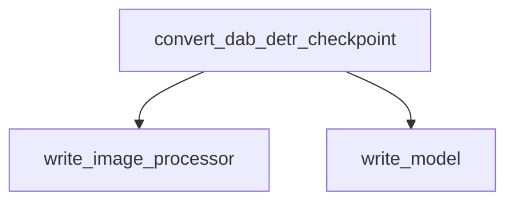

# dab_detr_models

This module handles the conversion of original DAB-DETR (Detection TRansformer with Anchors bAsed on Box-level query) PyTorch checkpoints to the Hugging Face Transformers format. It facilitates the seamless integration and usage of pre-trained DAB-DETR models within the Hugging Face ecosystem, enabling developers to leverage these models for object detection tasks.

## Architecture and Component Relationships

The `dab_detr_models` module primarily consists of a checkpoint conversion utility. The `convert_dab_detr_checkpoint` function orchestrates the conversion process by delegating tasks to internal helper functions responsible for image processor and model weight conversion.

<!-- DIAGRAM_JSON
{
    "direction": "TD",
    "nodes": [
        {"id": "convert_checkpoint", "label": "convert_dab_detr_checkpoint", "type": "component", "link": null},
        {"id": "write_image_processor", "label": "write_image_processor", "type": "component", "link": null},
        {"id": "write_model", "label": "write_model", "type": "component", "link": null}
    ],
    "edges": [
        {"source": "convert_checkpoint", "target": "write_image_processor"},
        {"source": "convert_checkpoint", "target": "write_model"}
    ],
    "groups": []
}
-->



## Core Functionality

### `convert_dab_detr_checkpoint`

This function serves as the main entry point for converting a DAB-DETR model checkpoint. It performs the following steps:

1.  **Image Processor Conversion:** Initiates the conversion of the image processor, which is crucial for preparing input images for the DAB-DETR model.
2.  **Model Weight Conversion:** Converts the core model weights from the original PyTorch format to the Hugging Face Transformers format.

**Source Code:**

```python
def convert_dab_detr_checkpoint(model_name, pretrained_model_weights_path, pytorch_dump_folder_path, push_to_hub):
    logger.info("Converting image processor...")
    write_image_processor(model_name, pytorch_dump_folder_path, push_to_hub)

    logger.info(f"Converting model {model_name}...")
    write_model(model_name, pretrained_model_weights_path, pytorch_dump_folder_path, push_to_hub)
```

**Parameters:**

*   `model_name`: The name of the DAB-DETR model being converted.
*   `pretrained_model_weights_path`: The file path to the original pre-trained PyTorch model weights.
*   `pytorch_dump_folder_path`: The directory where the converted Hugging Face model and image processor will be saved.
*   `push_to_hub`: A boolean indicating whether to push the converted model to the Hugging Face Hub.

## How the Module Fits into the Overall System

The `dab_detr_models` module is a specialized component within the broader `transformers` library, specifically under the `models` category. It plays a vital role in extending the range of supported object detection models by enabling the use of DAB-DETR checkpoints. This module ensures that users can easily integrate and fine-tune DAB-DETR models for various downstream tasks, contributing to the flexibility and versatility of the Hugging Face ecosystem. It depends on general utility functions for model and image processor writing, which are implicitly available within the Transformers library's conversion utilities.
