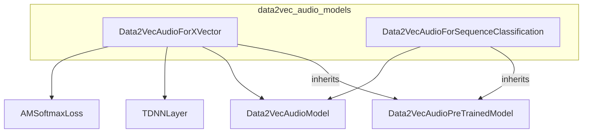

# data2vec_audio_models
This module provides Data2Vec Audio models tailored for X-vector speaker verification and general sequence classification tasks, building upon a shared pre-trained audio model.

<!-- DIAGRAM_JSON
{
    "nodes": [
        {
            "id": "Data2VecAudioForXVector",
            "label": "Data2VecAudioForXVector",
            "type": "class"
        },
        {
            "id": "Data2VecAudioForSequenceClassification",
            "label": "Data2VecAudioForSequenceClassification",
            "type": "class"
        },
        {
            "id": "Data2VecAudioPreTrainedModel",
            "label": "Data2VecAudioPreTrainedModel",
            "type": "class"
        },
        {
            "id": "Data2VecAudioModel",
            "label": "Data2VecAudioModel",
            "type": "class"
        },
        {
            "id": "TDNNLayer",
            "label": "TDNNLayer",
            "type": "class"
        },
        {
            "id": "AMSoftmaxLoss",
            "label": "AMSoftmaxLoss",
            "type": "class"
        }
    ],
    "edges": [
        {
            "source": "Data2VecAudioForXVector",
            "target": "Data2VecAudioPreTrainedModel",
            "type": "inheritance"
        },
        {
            "source": "Data2VecAudioForSequenceClassification",
            "target": "Data2VecAudioPreTrainedModel",
            "type": "inheritance"
        },
        {
            "source": "Data2VecAudioForXVector",
            "target": "Data2VecAudioModel",
            "type": "composition"
        },
        {
            "source": "Data2VecAudioForSequenceClassification",
            "target": "Data2VecAudioModel",
            "type": "composition"
        },
        {
            "source": "Data2VecAudioForXVector",
            "target": "TDNNLayer",
            "type": "composition"
        },
        {
            "source": "Data2VecAudioForXVector",
            "target": "AMSoftmaxLoss",
            "type": "composition"
        }
    ],
    "groups": []
}
-->
