The `data_preparation` module is the cornerstone for transforming raw input data into a format suitable for various transformer models. It provides comprehensive tools for tokenizing text and audio, processing images, and handling multimodal inputs, ensuring efficient and accurate data readiness for model training and inference.

### How it Works

The module is structured into three main functional areas: **Tokenization Services**, **Image Processing**, and **General Data Processors**. These areas work in concert to prepare diverse data types for model consumption.

*   **Tokenization Services** define the fundamental interfaces for converting raw text and audio into discrete tokens, and provide efficient backend implementations for this process.
*   **Image Processing** offers utilities and model-specific implementations for transforming raw image data, including resizing, normalization, and feature extraction.
*   **General Data Processors** handle more complex or multimodal data preparation, such as combining text and image inputs, or performing specialized text normalization.

These components are designed to be modular, allowing different models to leverage shared processing utilities while also providing specialized logic where needed.

```mermaid
flowchart TD
    subgraph tokenization["Tokenization Services"]
        text_tokenizer_base["Text Tokenizer Base (API)"]
        audio_tokenizer_base["Audio Tokenizer Base (API)"]
        fast_tokenizer_impl["Fast Tokenizer Backend"]
    end

    subgraph image_processing["Image Processing"]
        image_feature_mixin["Image Feature Extraction Mixin"]
        torchvision_backend["Torchvision Processing Backend"]
        model_image_procs["Model-Specific Image Processors"]
    end

    subgraph general_processing["General Data Processors"]
        multimodal_procs["Multimodal Data Processors"]
        number_normalizer["Number Normalization Utility"]
    end

    fast_tokenizer_impl ==>|"implements text API"| text_tokenizer_base
    fast_tokenizer_impl ==>|"implements audio API"| audio_tokenizer_base
    
    image_feature_mixin -->|"provides utilities"| model_image_procs
    torchvision_backend -->|"powers transformations"| model_image_procs
    
    multimodal_procs -->|"uses text tokenizers"| text_tokenizer_base
    multimodal_procs -->|"uses image processors"| image_feature_mixin
    multimodal_procs -->|"integrates number normalization"| number_normalizer

    classDef surface fill:#dbeafe,stroke:#3b82f6,stroke-width:2px,color:#1e3a5f
    classDef data fill:#d1fae5,stroke:#10b981,stroke-width:2px,color:#065f46
    classDef generative fill:#fed7aa,stroke:#ea580c,stroke-width:1px,color:#7c2d12
    classDef analytical fill:#ede9fe,stroke:#8b5cf6,stroke-width:1px,color:#4c1d95

    class text_tokenizer_base,audio_tokenizer_base,image_feature_mixin analytical
    class fast_tokenizer_impl,torchvision_backend,model_image_procs,multimodal_procs,number_normalizer generative

    click text_tokenizer_base "src.transformers.tokenization_utils_base.PreTrainedTokenizerBase.md" "View PreTrainedTokenizerBase"
    click audio_tokenizer_base "src.transformers.modeling_utils.PreTrainedAudioTokenizerBase.md" "View PreTrainedAudioTokenizerBase"
    click fast_tokenizer_impl "src.transformers.tokenization_utils_tokenizers.TokenizersBackend.md" "View TokenizersBackend"
    click image_feature_mixin "src.transformers.image_utils.ImageFeatureExtractionMixin.md" "View ImageFeatureExtractionMixin"
    click torchvision_backend "src.transformers.image_processing_backends.TorchvisionBackend.md" "View TorchvisionBackend"
    click model_image_procs "src.transformers.models.chameleon.image_processing_chameleon.ChameleonImageProcessor.md" "View Model-Specific Image Processors (Example)"
    click multimodal_procs "src.transformers.models.colmodernvbert.processing_colmodernvbert.ColModernVBertProcessor.md" "View Multimodal Data Processors (Example)"
    click number_normalizer "src.transformers.models.speecht5.number_normalizer.EnglishNumberNormalizer.md" "View EnglishNumberNormalizer"
```

### Core Components Documentation

*   **`src.transformers.tokenization_utils_base.PreTrainedTokenizerBase`**: The abstract base class defining the common interface for all text tokenizers, handling encoding, decoding, and special tokens.
*   **`src.transformers.modeling_utils.PreTrainedAudioTokenizerBase`**: An abstract base class for audio tokenizers, specifying methods for encoding raw audio into discrete codebooks and decoding.
*   **`src.transformers.tokenization_utils_tokenizers.TokenizersBackend`**: Provides a high-performance backend for tokenization, leveraging the HuggingFace `tokenizers` library.
*   **`src.transformers.image_utils.ImageFeatureExtractionMixin`**: A mixin class offering foundational utilities for image feature extraction and common image transformations.
*   **`src.transformers.image_processing_backends.TorchvisionBackend`**: Integrates `torchvision` functionalities for efficient image processing operations.
*   **`src.transformers.models.chameleon.image_processing_chameleon.ChameleonImageProcessor`**: An example of a model-specific image processor, tailored for the Chameleon architecture.
*   **`src.transformers.models.colmodernvbert.processing_colmodernvbert.ColModernVBertProcessor`**: An example of a multimodal processor, designed to handle combined image and text inputs for models like ColModernVBert.
*   **`src.transformers.models.speecht5.number_normalizer.EnglishNumberNormalizer`**: A utility for normalizing numerical values and currency symbols in English text for speech processing tasks.