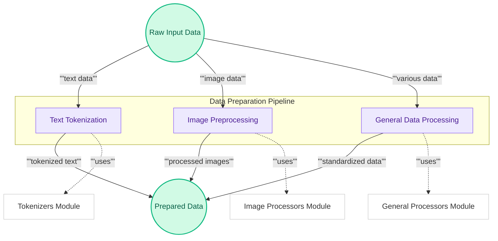

# Data Preparation Module
This module encompasses a suite of utilities for preparing diverse data types, including text, images, and multimodal inputs, ensuring they are correctly formatted and ready for subsequent model processing.

<!-- DIAGRAM_JSON
{
    "direction": "TD",
    "nodes": [
        {"id": "raw_data_input", "label": "Raw Input Data", "type": "data", "link": null},
        {"id": "process_text", "label": "Text Tokenization", "type": "component", "link": null},
        {"id": "process_images", "label": "Image Preprocessing", "type": "component", "link": null},
        {"id": "process_general", "label": "General Data Processing", "type": "component", "link": null},
        {"id": "prepared_data_output", "label": "Prepared Data", "type": "data", "link": null},
        {"id": "tokenizers_mod", "label": "Tokenizers Module", "type": "external", "link": "tokenizers.md"},
        {"id": "image_processors_mod", "label": "Image Processors Module", "type": "external", "link": "image_processors.md"},
        {"id": "general_processors_mod", "label": "General Processors Module", "type": "external", "link": "general_processors.md"}
    ],
    "edges": [
        {"source": "raw_data_input", "target": "process_text", "label": "text data"},
        {"source": "raw_data_input", "target": "process_images", "label": "image data"},
        {"source": "raw_data_input", "target": "process_general", "label": "various data"},
        {"source": "process_text", "target": "prepared_data_output", "label": "tokenized text"},
        {"source": "process_images", "target": "prepared_data_output", "label": "processed images"},
        {"source": "process_general", "target": "prepared_data_output", "label": "standardized data"},
        {"source": "process_text", "target": "tokenizers_mod", "label": "uses"},
        {"source": "process_images", "target": "image_processors_mod", "label": "uses"},
        {"source": "process_general", "target": "general_processors_mod", "label": "uses"}
    ],
    "groups": [
        {"id": "data_preparation_pipeline", "label": "Data Preparation Pipeline", "role": "analytical", "nodes": ["process_text", "process_images", "process_general"]}
    ]
}
-->
