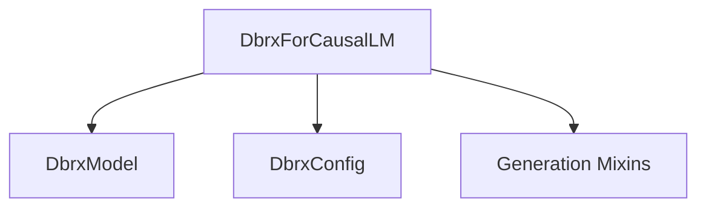

# dbrx_models

The `dbrx_models` module provides the implementation for the Dbrx family of models, focusing on causal language modeling. The core component of this module is `DbrxForCausalLM`, which is designed to generate text based on a given prompt.

## Architecture and Core Components

### DbrxForCausalLM

`DbrxForCausalLM` is a causal language model based on the Dbrx architecture. It extends `DbrxPreTrainedModel` and integrates with the `GenerationMixin` for text generation capabilities. This model is particularly suited for tasks requiring sequential text generation, such as chatbots, content creation, and code generation.

**Key Features:**

- **Mixture-of-Experts (MoE) Architecture**: Leverages MoE for efficient scaling and improved performance, as indicated by `router_aux_loss_coef`, `num_experts`, and `num_experts_per_tok` configuration parameters.
- **Flexible Input Handling**: Supports various input formats including `input_ids`, `attention_mask`, `position_ids`, and `inputs_embeds`.
- **Caching Mechanism**: Utilizes `past_key_values` for optimized sequence generation.
- **Loss Computation**: Includes a mechanism to compute both the standard language modeling loss and an auxiliary load balancing loss for the MoE layers.
- **Configurable Output**: Allows control over whether `router_logits` are returned.

```python
class DbrxForCausalLM(DbrxPreTrainedModel, GenerationMixin):
    _tied_weights_keys = {"lm_head.weight": "transformer.wte.weight"}
    _tp_plan = {"lm_head": "colwise_gather_output"}
    _pp_plan = {"lm_head": (["hidden_states"], ["logits"])}

    def __init__(self, config: DbrxConfig):
        super().__init__(config)
        self.transformer = DbrxModel(config)
        self.vocab_size = config.vocab_size
        self.lm_head = nn.Linear(config.hidden_size, config.vocab_size, bias=False)
        self.router_aux_loss_coef = config.ffn_config.moe_loss_weight
        self.num_experts = config.ffn_config.moe_num_experts
        self.num_experts_per_tok = config.ffn_config.moe_top_k
        self.post_init()

    def get_input_embeddings(self) -> nn.Embedding:
        return self.transformer.get_input_embeddings()

    def set_input_embeddings(self, value: nn.Embedding):
        self.transformer.set_input_embeddings(value)

    def get_output_embeddings(self) -> nn.Linear:
        return self.lm_head

    def set_output_embeddings(self, new_embeddings: nn.Linear):
        self.lm_head = new_embeddings

    def set_decoder(self, decoder: DbrxModel):
        self.transformer = decoder

    def get_decoder(self) -> DbrxModel:
        return self.transformer

    @can_return_tuple
    @auto_docstring
    def forward(
        self,
        input_ids: torch.LongTensor | None = None,
        attention_mask: torch.Tensor | None = None,
        position_ids: torch.LongTensor | None = None,
        past_key_values: Cache | None = None,
        inputs_embeds: torch.FloatTensor | None = None,
        labels: torch.LongTensor | None = None,
        use_cache: bool | None = None,
        output_router_logits: bool | None = None,
        logits_to_keep: int | torch.Tensor = 0,
        **kwargs: Unpack[TransformersKwargs],
    ) -> MoeCausalLMOutputWithPast:
        r"""
        labels (`torch.LongTensor` of shape `(batch_size, sequence_length)`, *optional*):
            Labels for computing the masked language modeling loss. Indices should either be in `[0, ...,
            config.vocab_size]` or -100 (see `input_ids` docstring). Tokens with indices set to `-100` are ignored
            (masked), the loss is only computed for the tokens with labels in `[0, ..., config.vocab_size]`.

        Example:

        ```python
        >> from transformers import AutoTokenizer, DbrxForCausalLM

        >> model = DbrxForCausalLM.from_pretrained("transformers-community/dbrx-instruct")
        >> tokenizer = AutoTokenizer.from_pretrained("transformers-community/dbrx-instruct")

        >> prompt = "Hey, are you conscious? Can you talk to me?"
        >> inputs = tokenizer(prompt, return_tensors="pt")

        >> # Generate
        >> generate_ids = model.generate(inputs.input_ids, max_length=30)
        >> tokenizer.batch_decode(generate_ids, skip_special_tokens=True, clean_up_tokenization_spaces=False)[0]
        "Hey, are you conscious? Can you talk to me?
I'm not conscious, but I can talk to you."
        ```
        """
        output_router_logits = (
            output_router_logits if output_router_logits is not None else self.config.output_router_logits
        )

        # decoder outputs consists of (dec_features, layer_state, dec_hidden, dec_attn)
        outputs: MoeModelOutputWithPast = self.transformer(
            input_ids=input_ids,
            attention_mask=attention_mask,
            position_ids=position_ids,
            past_key_values=past_key_values,
            inputs_embeds=inputs_embeds,
            use_cache=use_cache,
            output_router_logits=output_router_logits,
            **kwargs,
        )

        hidden_states = outputs.last_hidden_state
        # Only compute necessary logits, and do not upcast them to float if we are not computing the loss
        slice_indices = slice(-logits_to_keep, None) if isinstance(logits_to_keep, int) else logits_to_keep
        logits = self.lm_head(hidden_states[:, slice_indices, :])

        loss = None
        if labels is not None:
            loss = self.loss_function(logits, labels, self.vocab_size, **kwargs)

        aux_loss = None
        if output_router_logits:
            aux_loss = load_balancing_loss_func(
                outputs.router_logits,
                self.num_experts,
                self.num_experts_per_tok,
                attention_mask,
            )
            if labels is not None:
                loss += self.router_aux_loss_coef * aux_loss.to(loss.device)  # make sure to reside in the same device

        return MoeCausalLMOutputWithPast(
            loss=loss,
            aux_loss=aux_loss,
            logits=logits,
            past_key_values=outputs.past_key_values,
            hidden_states=outputs.hidden_states,
            attentions=outputs.attentions,
            router_logits=outputs.router_logits,
        )
```

### Relationship with other modules

The `dbrx_models` module primarily depends on:
- The [generation_mixins](generation_mixins.md) module for core generation functionalities through `GenerationMixin`.

## Diagrams

<!-- DIAGRAM_JSON
{
    "direction": "TD",
    "nodes": [
        {"id": "dbrx_causal_lm", "label": "DbrxForCausalLM", "type": "component", "link": null},
        {"id": "dbrx_model", "label": "DbrxModel", "type": "component", "link": null},
        {"id": "dbrx_config", "label": "DbrxConfig", "type": "component", "link": null},
        {"id": "generation_mixins", "label": "Generation Mixins", "type": "external", "link": "generation_mixins.md"}
    ],
    "edges": [
        {"source": "dbrx_causal_lm", "target": "dbrx_model"},
        {"source": "dbrx_causal_lm", "target": "dbrx_config"},
        {"source": "dbrx_causal_lm", "target": "generation_mixins"}
    ],
    "groups": []
}
-->
