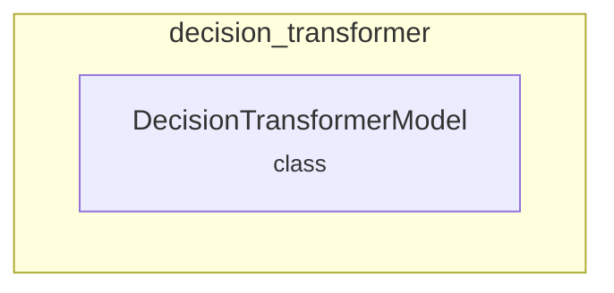

# decision_transformer
The `decision_transformer` module implements `DecisionTransformerModel`, an autoregressive model leveraging GPT-2 architecture for offline reinforcement learning to predict actions.

<!-- DIAGRAM_JSON
{
  "nodes": [
    {
      "id": "decision_transformer",
      "label": "decision_transformer",
      "type": "module"
    },
    {
      "id": "DecisionTransformerModel",
      "label": "DecisionTransformerModel",
      "type": "class"
    }
  ],
  "edges": [
    {
      "source": "decision_transformer",
      "target": "DecisionTransformerModel",
      "type": "contains"
    }
  ],
  "groups": [
    {
      "id": "decision_transformer_group",
      "label": "decision_transformer",
      "nodes": ["DecisionTransformerModel"]
    }
  ]
}
-->
