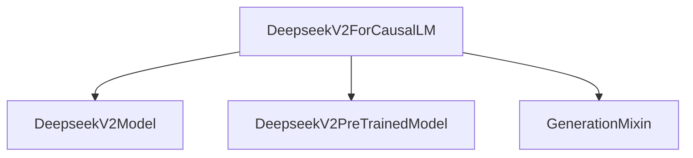

# DeepseekV2 Models Module Documentation

## Introduction

The `deepseek_v2_models` module provides the core implementation for the DeepseekV2 causal language model within the `transformers` library. Its primary purpose is to enable text generation capabilities using the DeepseekV2 architecture.

## Core Functionality: `DeepseekV2ForCausalLM`

The `DeepseekV2ForCausalLM` class is the central component of this module. It is a causal language model designed for sequence-to-sequence generation tasks, particularly text completion and generation. It extends `DeepseekV2PreTrainedModel` and integrates with `GenerationMixin` to provide standard generation functionalities.

### `DeepseekV2ForCausalLM` Class

-   **Purpose**: Implements the DeepseekV2 architecture for causal language modeling, allowing for text generation and optionally computing a loss for training.
-   **Inheritance**: Inherits from `DeepseekV2PreTrainedModel` (providing common functionalities for pre-trained models) and `GenerationMixin` (offering methods for various generation strategies like greedy search, beam search, etc.).
-   **Architecture**: Internally uses `DeepseekV2Model` to process input and generate hidden states, which are then passed through an `lm_head` (a linear layer) to produce logits over the vocabulary.
-   **Key Methods**:
    -   `forward(input_ids, attention_mask, position_ids, past_key_values, inputs_embeds, labels, use_cache, logits_to_keep, **kwargs)`:
        -   Processes input tokens (`input_ids`) and other relevant tensors (e.g., `attention_mask`, `position_ids`).
        -   Utilizes `DeepseekV2Model` to compute the hidden states.
        -   Calculates `logits` from the hidden states using `lm_head`.
        -   Optionally computes a `loss` if `labels` are provided.
        -   Returns `CausalLMOutputWithPast` containing loss, logits, past key values, hidden states, and attentions.
-   **Usage Example**: The class includes a clear example demonstrating how to load a pre-trained `DeepseekV2ForCausalLM` model and tokenizer, and then use it to generate text based on a given prompt.

## Architecture and Component Relationships

The `deepseek_v2_models` module, particularly the `DeepseekV2ForCausalLM`, interacts with several other components within the `transformers` ecosystem.

<!-- DIAGRAM_JSON
{
    "direction": "TD",
    "nodes": [
        {"id": "deepseekv2_for_causal_lm", "label": "DeepseekV2ForCausalLM", "type": "component", "link": null},
        {"id": "deepseekv2_model", "label": "DeepseekV2Model", "type": "component", "link": null},
        {"id": "deepseekv2_pretrained_model", "label": "DeepseekV2PreTrainedModel", "type": "external", "link": "modeling_utilities.md"},
        {"id": "generation_mixin", "label": "GenerationMixin", "type": "external", "link": "generation_mixins.md"}
    ],
    "edges": [
        {"source": "deepseekv2_for_causal_lm", "target": "deepseekv2_model"},
        {"source": "deepseekv2_for_causal_lm", "target": "deepseekv2_pretrained_model"},
        {"source": "deepseekv2_for_causal_lm", "target": "generation_mixin"}
    ],
    "groups": []
}
-->

## How the Module Fits into the Overall System

The `deepseek_v2_models` module is a specialized model implementation within the broader `transformers` library. It provides the specific architecture and forward pass logic for the DeepseekV2 model for causal language modeling tasks.

-   **Integration with `transformers`**: It leverages base classes like `DeepseekV2PreTrainedModel` (which itself likely derives from `PreTrainedModel` in [modeling_utilities.md](modeling_utilities.md)) and mixins such as `GenerationMixin` (from [generation_mixins.md](generation_mixins.md)) to conform to the standard `transformers` API.
-   **Text Generation Pipelines**: Models from this module can be directly used with `transformers` pipelines for text generation, leveraging the `GenerationMixin`'s capabilities.
-   **Training and Fine-tuning**: The `forward` method's ability to compute a loss when `labels` are provided makes `DeepseekV2ForCausalLM` suitable for fine-tuning on various causal language modeling datasets.