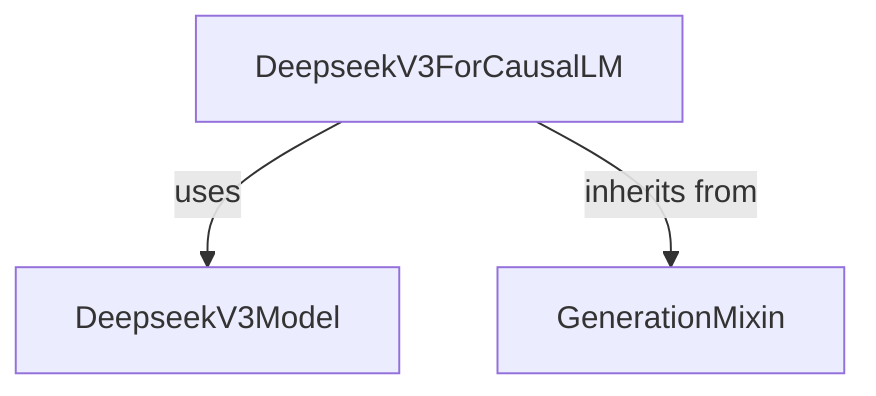

# DeepseekV3 Models Module Documentation

## Introduction

This module (`deepseek_v3_models`) provides the core implementation for the DeepseekV3 causal language model, `DeepseekV3ForCausalLM`. It is designed for generating text sequences based on a given prompt, leveraging the DeepseekV3 architecture.

## Core Functionality

The primary component within this module is `DeepseekV3ForCausalLM`, which extends the `DeepseekV3PreTrainedModel` and incorporates functionalities from `GenerationMixin` to facilitate text generation tasks.

### `DeepseekV3ForCausalLM`

-   **Purpose**: Implements a causal language model based on the DeepseekV3 architecture. It predicts the next token in a sequence, making it suitable for tasks like text completion, conversational AI, and other generative language tasks.

-   **Inheritance**: It inherits from `DeepseekV3PreTrainedModel` (providing base model functionalities like weight initialization and loading) and `GenerationMixin` ([generation_mixins.md](generation_mixins.md)), which supplies common methods for controlling text generation (e.g., beam search, sampling).

-   **Internal Components**:
    -   `model`: An instance of `DeepseekV3Model`, representing the core DeepseekV3 transformer architecture that processes input tokens and produces hidden states.
    -   `lm_head`: A linear layer (`nn.Linear`) that projects the hidden states from the `DeepseekV3Model` to the vocabulary space, producing logits for each possible next token.

-   **`forward` Method**: This method performs the forward pass through the model. It takes the following key inputs:
    -   `input_ids`: Tokenized input sequences.
    -   `attention_mask`: Mask to avoid performing attention on padding tokens.
    -   `position_ids`: Positional indices for each token.
    -   `past_key_values`: Cached key and value states for efficient sequential decoding.
    -   `inputs_embeds`: Optional direct input embeddings instead of `input_ids`.
    -   `labels`: Optional target labels for calculating the language modeling loss.
    -   `use_cache`: Whether to return `past_key_values`.
    -   `logits_to_keep`: Specifies which logits to keep for memory efficiency.

    The method first processes the inputs through the internal `DeepseekV3Model` to obtain hidden states. It then uses the `lm_head` to compute logits. If `labels` are provided, it also calculates the causal language modeling loss. It returns a `CausalLMOutputWithPast` object containing the loss, logits, and updated `past_key_values`.

## Architecture and Component Relationships

The `deepseek_v3_models` module focuses on the `DeepseekV3ForCausalLM`, which integrates the base `DeepseekV3Model` with generation capabilities.

<!-- DIAGRAM_JSON
{
    "direction": "TD",
    "nodes": [
        {"id": "deepseek_v3_causal_lm", "label": "DeepseekV3ForCausalLM", "type": "component", "link": null},
        {"id": "deepseek_v3_model", "label": "DeepseekV3Model", "type": "component", "link": null},
        {"id": "generation_mixin", "label": "GenerationMixin", "type": "external", "link": "generation_mixins.md"}
    ],
    "edges": [
        {"source": "deepseek_v3_causal_lm", "target": "deepseek_v3_model", "label": "uses"},
        {"source": "deepseek_v3_causal_lm", "target": "generation_mixin", "label": "inherits from"}
    ],
    "groups": []
}
-->
