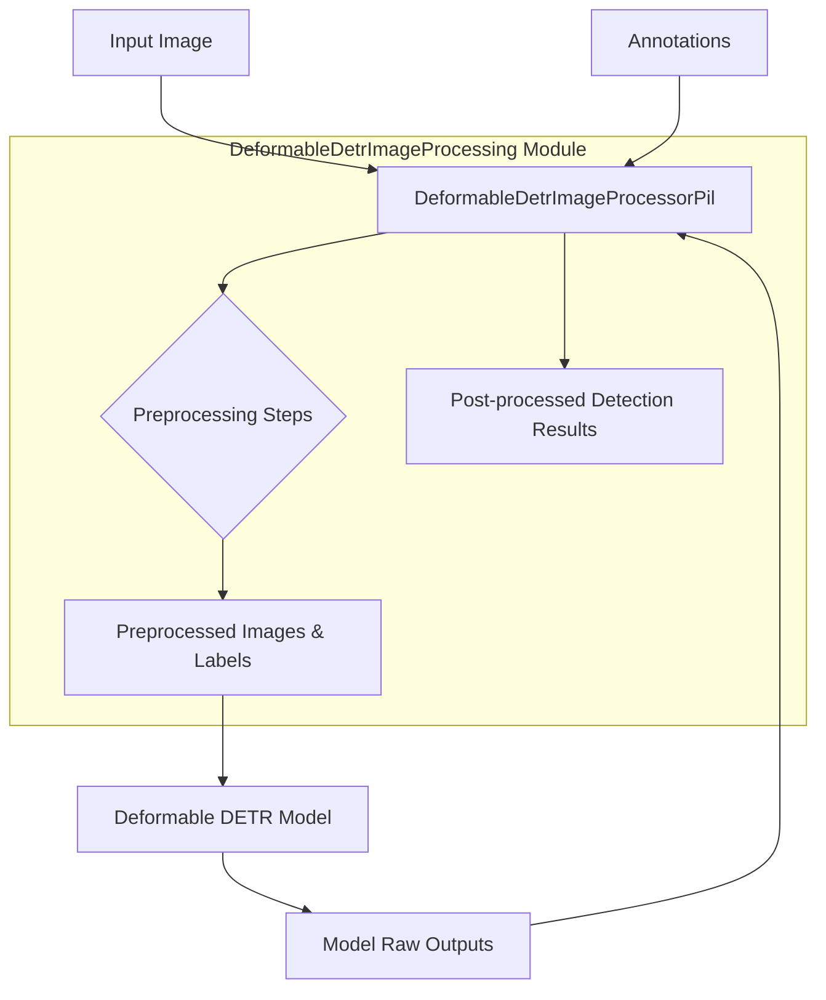

# Deformable DETR Image Processing Module

## Introduction

This document provides comprehensive documentation for the `deformable_detr_image_processing` module. This module is specifically designed to handle the intricate preprocessing of images and their corresponding annotations, as well as the post-processing of model outputs, for the Deformable DETR (Detection Transformer) model.

## Module Purpose and Core Functionality

The `deformable_detr_image_processing` module, primarily through its `DeformableDetrImageProcessorPil` class, serves as a crucial component in the Deformable DETR pipeline. Its main purpose is to prepare visual data for optimal input into the Deformable DETR model and to interpret the raw outputs generated by the model.

Key functionalities include:

-   **Image Resizing**: The processor intelligently resizes input images. It can either maintain the aspect ratio while fitting the image within specified shortest and longest edge constraints, or resize to an exact `(height, width)` dimension.
-   **Image Rescaling and Normalization**: It applies standard rescaling and normalization operations (using configurable `image_mean` and `image_std`) to image pixel values, which are essential steps for preparing images for deep learning models.
-   **Image Padding**: To facilitate batch processing and handle varying image dimensions, the module pads images to a uniform `padded_size`. During this process, it also generates `pixel_mask` arrays that distinguish valid image pixels from padding.
-   **Annotation Preparation and Transformation**: The processor is capable of handling COCO-style detection and panoptic annotations. It prepares these annotations, resizing and normalizing bounding boxes and segmentation masks in sync with the image transformations. This ensures that ground truth data accurately corresponds to the preprocessed images.
-   **Output Post-processing**: It transforms the raw outputs (logits and predicted bounding boxes) from the Deformable DETR model into a more interpretable format. This includes converting normalized bounding box coordinates to absolute pixel values and applying score thresholds to filter predictions, ultimately yielding object detection results with scores, labels, and concrete bounding box locations.

## Architecture and Component Relationships

The `deformable_detr_image_processing` module is centered around the `DeformableDetrImageProcessorPil` class. This class extends `PilBackend`, indicating its foundation on the Pillow (PIL) library for robust image manipulation capabilities.

<!-- DIAGRAM_JSON
{
    "direction": "TD",
    "nodes": [
        {"id": "input_image", "label": "Input Image", "type": "external", "link": null},
        {"id": "annotations", "label": "Annotations", "type": "external", "link": null},
        {"id": "deformable_detr_image_processor_pil", "label": "DeformableDetrImageProcessorPil", "type": "component", "link": null},
        {"id": "preprocessing_steps", "label": "Preprocessing Steps", "type": "component", "link": null},
        {"id": "preprocessed_images_labels", "label": "Preprocessed Images & Labels", "type": "component", "link": null},
        {"id": "deformable_detr_model", "label": "Deformable DETR Model", "type": "external", "link": "deformable_detr_models.md"},
        {"id": "model_raw_outputs", "label": "Model Raw Outputs", "type": "component", "link": null},
        {"id": "post_processed_detection_results", "label": "Post-processed Detection Results", "type": "component", "link": null}
    ],
    "edges": [
        {"source": "input_image", "target": "deformable_detr_image_processor_pil"},
        {"source": "annotations", "target": "deformable_detr_image_processor_pil"},
        {"source": "deformable_detr_image_processor_pil", "target": "preprocessing_steps"},
        {"source": "preprocessing_steps", "target": "preprocessed_images_labels"},
        {"source": "preprocessed_images_labels", "target": "deformable_detr_model"},
        {"source": "deformable_detr_model", "target": "model_raw_outputs"},
        {"source": "model_raw_outputs", "target": "deformable_detr_image_processor_pil"},
        {"source": "deformable_detr_image_processor_pil", "target": "post_processed_detection_results"}
    ],
    "groups": [
        {"id": "deformable_detr_image_processing_module", "label": "DeformableDetrImageProcessing Module", "nodes": ["deformable_detr_image_processor_pil", "preprocessing_steps", "preprocessed_images_labels", "post_processed_detection_results"]}
    ]
}
-->

## How the Module Fits into the Overall System

The `deformable_detr_image_processing` module is an integral part of the larger Deformable DETR model ecosystem. It serves as the dedicated data handling layer, ensuring seamless interaction between raw visual data, the model, and the final application outputs.

-   **Input Data Pipeline**: This module forms the initial stage of the data pipeline for the Deformable DETR model. It takes raw images and annotations and transforms them into a standardized format (`pixel_values`, `pixel_mask`, and `labels`) that the `deformable_detr_models` expects. This standardization is critical for the model's efficient and accurate operation.
-   **Decoupling Preprocessing Logic**: By encapsulating complex image and annotation transformations, the module decouples the data preparation logic from the core model architecture. This separation improves modularity, making the `deformable_detr_models` easier to understand, maintain, and adapt.
-   **Consistent Data Handling**: It ensures a consistent approach to data preprocessing and post-processing, which is vital for reproducibility and reliable performance of the Deformable DETR model across different datasets and use cases.
-   **Facilitating Model Interpretation**: After the `deformable_detr_models` generates its predictions, this module takes on the responsibility of translating these raw outputs into meaningful object detection results, making the model's insights directly actionable for downstream tasks or user display.

In essence, the `deformable_detr_image_processing` module acts as a critical intermediary, optimizing data flow and enhancing the overall usability and effectiveness of the Deformable DETR object detection system.