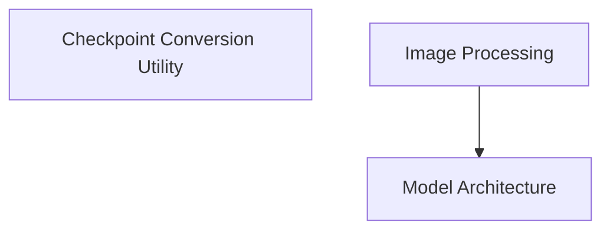

# Deformable DETR Models Module Documentation

## Introduction

The `deformable_detr_models` module provides the core components for implementing and utilizing Deformable DETR (Detection Transformer) models. This includes utilities for converting pre-trained model checkpoints, advanced image preprocessing capabilities, and the main model architecture for object detection.

## Architecture Overview

The module is structured into three main sub-modules:

1.  **Checkpoint Conversion Utility**: Facilitates the adaptation of original Deformable DETR model weights to the Hugging Face format.
2.  **Image Processing**: Handles all necessary image and annotation preprocessing steps for the model.
3.  **Model Architecture**: Contains the definition and implementation of the Deformable DETR model itself, designed for object detection tasks.

These components work in tandem, with the image processing pipeline preparing data for the model architecture, and the conversion utility ensuring compatibility with various pre-trained models.

<!-- DIAGRAM_JSON
{
    "direction": "TD",
    "nodes": [
        {"id": "conversion_utility", "label": "Checkpoint Conversion Utility", "type": "module", "link": "conversion_utility.md"},
        {"id": "image_processing", "label": "Image Processing", "type": "module", "link": "image_processing.md"},
        {"id": "model_architecture", "label": "Model Architecture", "type": "module", "link": "model_architecture.md"}
    ],
    "edges": [
        {"source": "image_processing", "target": "model_architecture"}
    ],
    "groups": []
}
-->

## Sub-modules

### [Checkpoint Conversion Utility](conversion_utility.md)

This sub-module focuses on the `convert_deformable_detr_checkpoint` function, which is responsible for taking original Deformable DETR model weights and converting them into a format compatible with Hugging Face PyTorch models. It handles the renaming of keys, special treatment for query, key, and value matrices, and prepends prefixes to base model keys before loading the state dictionary into a `DeformableDetrForObjectDetection` model. It also includes verification steps to ensure correct conversion.

### [Image Processing](image_processing.md)

The `DeformableDetrImageProcessorPil` class within this sub-module provides comprehensive image preprocessing functionalities. It supports various operations such as resizing images to specific dimensions while maintaining aspect ratios, preparing COCO detection and panoptic annotations, normalizing pixel values, and padding images to a uniform size. It also handles the creation of pixel masks for padded areas and post-processing of model outputs for object detection, converting raw predictions into final bounding boxes.

### [Model Architecture](model_architecture.md)

This sub-module defines the `DeformableDetrForObjectDetection` model, which is built upon the `DeformableDetrModel` (encoder-decoder structure) and enhanced with detection heads for class prediction and bounding box regression. It supports configurations for single-scale, dilation, box refinement, and two-stage object detection. The `forward` method takes pixel values and optional masks, processing them through the Deformable DETR base model and then through the detection heads to produce class logits and predicted bounding boxes. It also includes an example of how to use the model for object detection tasks with an `AutoImageProcessor`.
