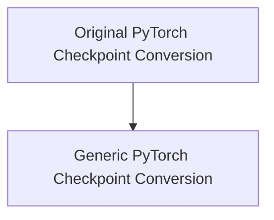

# DETR Conversion Utilities

This module provides essential utilities for converting Detection Transformer (DETR) model checkpoints from their original formats to the Hugging Face Transformers format. It streamlines the process of adapting pre-trained DETR models, ensuring compatibility and ease of use within the Hugging Face ecosystem. The conversion process includes renaming keys, adapting state dictionaries, and verifying the converted model's outputs.

## Architecture Overview

The `detr_conversion_utilities` module is designed to handle two primary types of DETR checkpoint conversions:

1.  **Original PyTorch Checkpoint Conversion**: Specifically tailored for models originating from the `facebookresearch/detr` repository.
2.  **Generic PyTorch Checkpoint Conversion**: A more generalized utility for converting various DETR PyTorch checkpoints.

Both conversion utilities ensure that the converted models are compatible with Hugging Face's `DetrForObjectDetection` and `DetrForSegmentation` classes, handling different backbone configurations and panoptic segmentation support.

<!-- DIAGRAM_JSON
{
    "direction": "TD",
    "nodes": [
        {"id": "original_pytorch_conversion", "label": "Original PyTorch Checkpoint Conversion", "type": "module", "link": "original_pytorch_conversion.md"},
        {"id": "generic_pytorch_conversion", "label": "Generic PyTorch Checkpoint Conversion", "type": "module", "link": "generic_pytorch_conversion.md"}
    ],
    "edges": [
        {"source": "original_pytorch_conversion", "target": "generic_pytorch_conversion", "label": "can be seen as a specific case of"}
    ],
    "groups": []
}
-->

## Sub-modules

*   [Original PyTorch Checkpoint Conversion](original_pytorch_conversion.md): This sub-module focuses on converting DETR models from the original PyTorch hub (`facebookresearch/detr`) to the Hugging Face format.
*   [Generic PyTorch Checkpoint Conversion](generic_pytorch_conversion.md): This sub-module provides a more generalized approach to converting DETR PyTorch checkpoints, offering flexibility for different model variations.