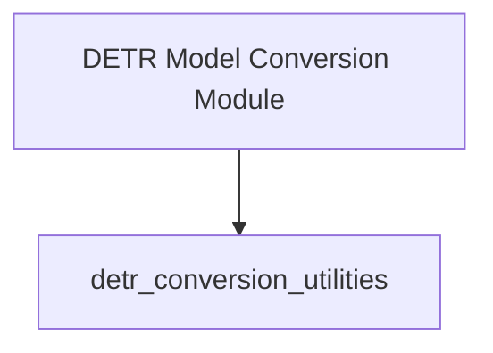

# Module: `detr_model_conversion`

## Introduction
The `detr_model_conversion` module serves as a central hub for utilities focused on converting various DETR (Detection Transformer) model checkpoints into a format compatible with the Hugging Face Transformers library. It aims to streamline the process of integrating different DETR model variants into the Hugging Face ecosystem.

## Purpose and Core Functionality
The primary purpose of this module is to organize and provide access to specialized conversion logic for DETR models. While it does not directly implement the intricate conversion steps, it acts as a gateway to its sub-modules, which are responsible for the detailed transformation of original checkpoints.
-   **Structured Conversion:** Groups related conversion functionalities for better organization and maintainability.
-   **Entry Point:** Serves as the high-level entry point for developers seeking to convert DETR models.
-   **Delegation:** Delegates the actual conversion tasks to its specialized child modules.

## Architecture and Component Relationships
The `detr_model_conversion` module adopts a hierarchical architecture, where it orchestrates access to its sub-modules for specific conversion tasks. It primarily consists of a single child module that encapsulates the core conversion utilities.

<!-- DIAGRAM_JSON
{
    "direction": "TD",
    "nodes": [
        {"id": "detr_model_conversion_module", "label": "DETR Model Conversion Module", "type": "component", "link": null},
        {"id": "detr_conversion_utilities", "label": "detr_conversion_utilities", "type": "external", "link": "detr_conversion_utilities.md"}
    ],
    "edges": [
        {"source": "detr_model_conversion_module", "target": "detr_conversion_utilities"}
    ],
    "groups": []
}
-->

The `detr_model_conversion_module` directs traffic to its child module, `detr_conversion_utilities`, which contains the concrete implementations for different DETR checkpoint conversion scenarios.

## How the Module Fits into the Overall System
The `detr_model_conversion` module plays a crucial role in the broader model integration strategy by ensuring that DETR models, regardless of their original source, can be seamlessly adapted for use within the Hugging Face Transformers library. By providing a centralized and organized approach to DETR model conversion, it promotes:
-   **Interoperability:** Facilitates the use of diverse DETR model implementations within a unified framework.
-   **Maintainability:** Centralizes conversion logic, making it easier to update and manage as new DETR models or conversion requirements emerge.
-   **Developer Experience:** Simplifies the process for developers to integrate and experiment with various DETR models.

This module depends on its sub-modules for the actual conversion logic and relies on the core `detr_models` module for model-specific configurations and architectures.