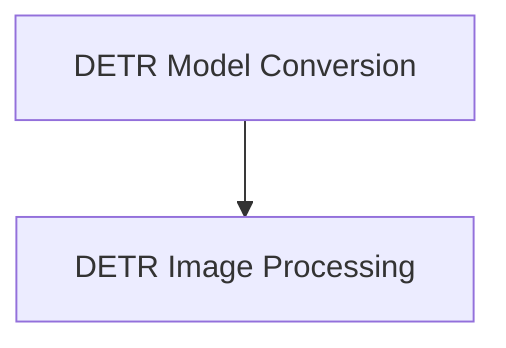

# DETR Models Documentation

The `detr_models` module provides core functionalities for the Detection Transformer (DETR) model, including utilities for model checkpoint conversion and robust image processing tailored for object detection and segmentation tasks. It serves as a bridge for using pre-trained DETR models within the Hugging Face Transformers ecosystem.

## Architecture Overview

The `detr_models` module is composed of two main sub-modules:

<!-- DIAGRAM_JSON
{
    "direction": "TD",
    "nodes": [
        {"id": "model_conversion", "label": "DETR Model Conversion", "type": "module", "link": "model_conversion.md"},
        {"id": "image_processing", "label": "DETR Image Processing", "type": "module", "link": "image_processing.md"}
    ],
    "edges": [
        {"source": "model_conversion", "target": "image_processing"}
    ],
    "groups": []
}
-->

## Sub-modules

### [DETR Model Conversion](model_conversion.md)
This sub-module focuses on the conversion of original DETR PyTorch checkpoints into a format compatible with the Hugging Face Transformers library. It allows for seamless integration and usage of pre-trained models.

### [DETR Image Processing](image_processing.md)
This sub-module provides comprehensive utilities for image preprocessing and post-processing, specifically designed for DETR models. It handles tasks such as resizing, normalization, and managing COCO annotations for both object detection and panoptic segmentation.