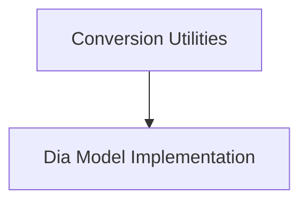

# Dia Models Documentation

The `dia_models` module provides the necessary components for working with Dia models, including utilities for converting models from Nari Labs format to Hugging Face format and the core Dia model architecture for conditional generation.

## Architecture Overview

The `dia_models` module is composed of two main sub-modules:

1.  **Conversion Utilities**: Manages the conversion process of Dia models.
2.  **Modeling**: Defines the core architecture of the Dia model for conditional generation.

These components work together to enable seamless integration and utilization of Dia models within the Hugging Face ecosystem.

<!-- DIAGRAM_JSON
{
    "direction": "TD",
    "nodes": [
        {"id": "conversion_utilities", "label": "Conversion Utilities", "type": "module", "link": "conversion_utilities.md"},
        {"id": "modeling", "label": "Dia Model Implementation", "type": "module", "link": "modeling.md"}
    ],
    "edges": [
        {"source": "conversion_utilities", "target": "modeling"}
    ],
    "groups": []
}
-->

## Sub-modules

### [Conversion Utilities](conversion_utilities.md)

This sub-module handles the conversion of Dia models from Nari Labs format to Hugging Face format. It includes functions to load original checkpoints and adapt their weights to the Hugging Face `DiaForConditionalGeneration` model.

### [Modeling](modeling.md)

This sub-module contains the core `DiaForConditionalGeneration` model architecture. It defines the model's layers, forward pass, and integrates with the DiaGenerationMixin for conditional generation capabilities. This is where the model's primary logic resides for generating audio outputs.