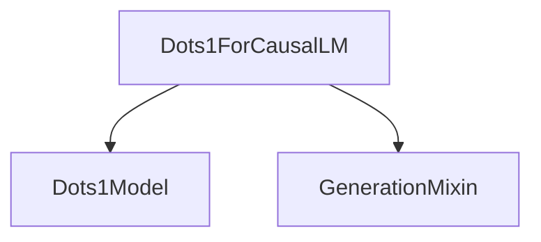

# Module: `dots1_models`

## Introduction
The `dots1_models` module is a crucial component within the `transformers` library, specifically designed to implement the Dots1 architecture for Causal Language Modeling (CLM). It provides the `Dots1ForCausalLM` class, which extends the base Dots1 model with a language modeling head to enable text generation capabilities.

## Core Functionality

### `Dots1ForCausalLM`
- **Purpose**: This class is responsible for implementing the Causal Language Model based on the Dots1 architecture. It takes the hidden states from the core Dots1 model and projects them to the vocabulary space to predict the next token in a sequence.
- **Key Features**:
    - **Causal Language Modeling**: Designed for tasks such as text generation, where the model predicts the next token based on the preceding context.
    - **Integration with `GenerationMixin`**: Inherits generation utilities, allowing for flexible text generation strategies (e.g., beam search, sampling).
    - **Loss Computation**: Includes functionality to compute the language modeling loss when labels are provided, facilitating training and fine-tuning.
- **Components**:
    - `model`: An instance of `Dots1Model` (which encapsulates the core Dots1 architecture) used to process input sequences and produce hidden states.
    - `lm_head`: A linear layer (`nn.Linear`) that maps the hidden states from the `model` to the vocabulary space, producing logits for each possible next token.
- **Usage Example**: The `forward` method demonstrates how to use the model for generation and loss computation. It accepts `input_ids`, `attention_mask`, `position_ids`, `past_key_values`, `inputs_embeds`, and `labels`.

## Architecture and Component Relationships

The `dots1_models` module primarily contains the `Dots1ForCausalLM` class. This class builds upon the core `Dots1Model` (which provides the base neural network architecture for Dots1) and integrates with the `GenerationMixin` for enhanced text generation capabilities.

<!-- DIAGRAM_JSON
{
    "direction": "TD",
    "nodes": [
        {"id": "dots1_for_causal_lm", "label": "Dots1ForCausalLM", "type": "component", "link": null},
        {"id": "dots1_model", "label": "Dots1Model", "type": "component", "link": null},
        {"id": "generation_mixin", "label": "GenerationMixin", "type": "external", "link": "generation_mixins.md"}
    ],
    "edges": [
        {"source": "dots1_for_causal_lm", "target": "dots1_model"},
        {"source": "dots1_for_causal_lm", "target": "generation_mixin"}
    ],
    "groups": []
}
-->

## How the Module Fits into the Overall System

The `dots1_models` module is an integral part of the `transformers` library, offering a specialized implementation of the Dots1 architecture for causal language modeling tasks. It leverages the generic `GenerationMixin` (documented in [generation_mixins.md](generation_mixins.md)) to provide robust text generation functionalities. Developers can use `Dots1ForCausalLM` for various natural language generation applications, building on the efficient and scalable Dots1 base model. Its clear separation of concerns, with the language modeling head built on top of the base model, allows for modularity and ease of extension within the broader `transformers` ecosystem.