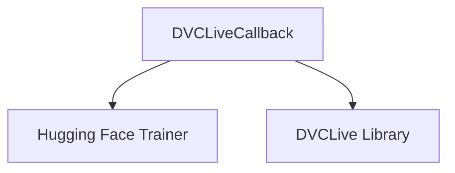

# Module: `dvclive_integration`

## Introduction

The `dvclive_integration` module provides a callback for integrating Hugging Face Transformers' `Trainer` with [DVCLive](https://dvc.org/doc/dvclive), a lightweight library for logging machine learning experiments. This integration allows users to automatically log training metrics, hyperparameters, and model checkpoints to DVCLive, facilitating experiment tracking and reproducibility.

## Comprehensive Documentation

The core component of this module is the `DVCLiveCallback` class, which extends the `TrainerCallback` from the Hugging Face Transformers library. It is designed to seamlessly plug into the training loop of a `Trainer` instance.

### `DVCLiveCallback`

- **Purpose**: To provide a mechanism for logging various aspects of a model training run (metrics, parameters, artifacts) to a DVCLive experiment.
- **Location**: `src.transformers.integrations.integration_utils.DVCLiveCallback`

#### Functionality

The `DVCLiveCallback` intercepts key events during the `Trainer`'s lifecycle to perform logging operations:

-   **Initialization (`__init__`)**:
    -   Checks for `dvclive` installation and raises an error if not found.
    -   Can be initialized with an existing `dvclive.Live` instance or will create a new one.
    -   Configures model logging behavior via `log_model` argument or the `HF_DVCLIVE_LOG_MODEL` environment variable. `log_model=True` logs the final best/last checkpoint, while `log_model="all"` logs the entire `output_dir` at each checkpoint save.
-   **Setup (`setup` / `on_train_begin`)**:
    -   Ensures DVCLive is initialized and ready for logging.
    -   Logs the `TrainingArguments` (hyperparameters) as parameters to the DVCLive experiment. This only happens on the world process zero in distributed training setups.
-   **Logging Metrics (`on_log`)**:
    -   Captures metrics reported by the `Trainer` at each logging step.
    -   Filters for scalar values (`dvclive.plots.Metric.could_log`) and logs them using `self.live.log_metric`.
    -   Advances the DVCLive experiment to the next step using `self.live.next_step()`.
-   **Saving Checkpoints (`on_save`)**:
    -   If `log_model` is set to `"all"`, the entire `output_dir` (containing the model, tokenizer, and other assets) is logged as an artifact using `self.live.log_artifact()` whenever the `Trainer` saves a checkpoint.
-   **End of Training (`on_train_end`)**:
    -   If `log_model` is set to `True`, the final (or best, if configured) model checkpoint is explicitly saved and logged as a `model` type artifact to DVCLive.
    -   The DVCLive experiment is gracefully ended using `self.live.end()`.

#### Configuration

Users can configure `DVCLiveCallback` via:
-   **`live` argument**: Pass an existing `dvclive.Live` object for fine-grained control.
-   **`log_model` argument**: A boolean or "all" to control model artifact logging.
-   **`HF_DVCLIVE_LOG_MODEL` environment variable**: Overrides `log_model` argument, accepting `TRUE`, `1`, or `all`.

## Architecture and Component Relationships

The `dvclive_integration` module, specifically the `DVCLiveCallback`, acts as a bridge between the Hugging Face `Trainer` and the DVCLive experiment tracking library.

<!-- DIAGRAM_JSON
{
    "direction": "TD",
    "nodes": [
        {"id": "dvclive_callback", "label": "DVCLiveCallback", "type": "component", "link": null},
        {"id": "hf_trainer", "label": "Hugging Face Trainer", "type": "external", "link": null},
        {"id": "dvclive_library", "label": "DVCLive Library", "type": "external", "link": null}
    ],
    "edges": [
        {"source": "dvclive_callback", "target": "hf_trainer"},
        {"source": "dvclive_callback", "target": "dvclive_library"}
    ],
    "groups": []
}
-->

-   **`DVCLiveCallback`**: This is the central component within the `dvclive_integration` module. It's an internal component responsible for orchestrating the logging process.
-   **Hugging Face `Trainer`**: `DVCLiveCallback` is designed to be used with the `Trainer` class from the `transformers` library. It extends `TrainerCallback` and relies on the `Trainer`'s lifecycle hooks to trigger its logging actions.
-   **DVCLive Library**: The callback directly interacts with the `dvclive.Live` object to log metrics, parameters, and artifacts. This is the external tool that `dvclive_integration` facilitates interaction with.

## How the Module Fits into the Overall System

The `dvclive_integration` module resides within the broader `integrations` section of the system. Its primary role is to extend the capabilities of the Hugging Face `Trainer` by providing a robust and easy-to-use interface for DVCLive experiment tracking. This allows developers to track their model training progress and store artifacts using DVCLive without needing to manually integrate logging calls into their training scripts. It serves as a specific integration point for a popular MLOps tool, enhancing the extensibility and utility of the core Transformers library.

For other integrations, refer to the [integrations module documentation](integrations.md).
