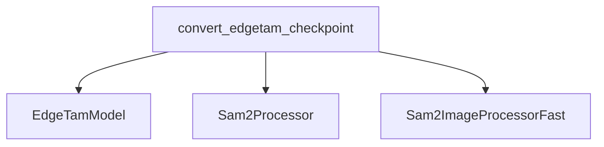

# EdgeTam Models Documentation

## Introduction

The `edgetam_models` module provides utilities for converting and managing EdgeTam model checkpoints within the Hugging Face ecosystem. Its primary function is to facilitate the conversion of pre-trained EdgeTam models into a format compatible with Hugging Face Transformers, enabling seamless integration and usage.

## Architecture and Component Relationships

This module primarily consists of a checkpoint conversion utility. It interacts with the core EdgeTam model definition and relies on image processing components from the `sam2_models` module for handling input data during sanity checks.

<!-- DIAGRAM_JSON
{
    "direction": "TD",
    "nodes": [
        {"id": "convert_checkpoint", "label": "convert_edgetam_checkpoint", "type": "component", "link": null},
        {"id": "edgetam_model", "label": "EdgeTamModel", "type": "component", "link": null},
        {"id": "sam2_processor", "label": "Sam2Processor", "type": "external", "link": "sam2_models.md"},
        {"id": "sam2_image_processor_fast", "label": "Sam2ImageProcessorFast", "type": "external", "link": "sam2_models.md"}
    ],
    "edges": [
        {"source": "convert_checkpoint", "target": "edgetam_model"},
        {"source": "convert_checkpoint", "target": "sam2_processor"},
        {"source": "convert_checkpoint", "target": "sam2_image_processor_fast"}
    ],
    "groups": []
}
-->

### Core Components

#### `convert_edgetam_checkpoint`

- **Location:** `src/transformers/models/edgetam/convert_edgetam_to_hf.py`
- **Purpose:** This function is responsible for the end-to-end conversion of an original EdgeTam model checkpoint into the Hugging Face Transformers format. It handles loading the original state dictionary, remapping keys if necessary, initializing the Hugging Face compatible `EdgeTamModel`, and performing an optional sanity check.
- **Functionality:**
    - Loads configuration specific to the EdgeTam model.
    - Loads and processes the original model's state dictionary.
    - Initializes `Sam2ImageProcessorFast` and `Sam2Processor` for image handling.
    - Instantiates the Hugging Face `EdgeTamModel`.
    - Loads the converted state dictionary into the `EdgeTamModel`, with validation for missing or unexpected keys.
    - Optionally performs a sanity check by running an inference with a sample image and asserting the output scores.
    - Saves the processor and the converted model to a specified folder and optionally pushes them to the Hugging Face Hub.
- **Dependencies:**
    - `EdgeTamModel`: The core model definition for EdgeTam, conceptually part of this module.
    - `Sam2Processor` and `Sam2ImageProcessorFast` from [sam2_models](sam2_models.md).
    - Internal utilities `get_config` and `replace_keys` (not detailed further as they are assumed to be internal helper functions).
    - Standard libraries for image processing (`PIL.Image`, `numpy`), network requests (`httpx`), and tensor operations (`torch`).

## System Integration

The `edgetam_models` module plays a crucial role in enabling the use of EdgeTam models within the broader Hugging Face ecosystem. By providing a clear conversion path, it allows researchers and developers to leverage pre-trained EdgeTam models with the extensive tools and functionalities offered by Hugging Face Transformers. This module acts as a bridge, ensuring compatibility and facilitating the deployment and fine-tuning of EdgeTam models alongside other Transformer-based architectures. Its reliance on shared processing utilities like `Sam2Processor` highlights its integration with other vision-related model modules.

