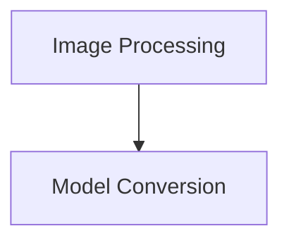

# EfficientLoFTR Models

The `efficientloftr_models` module provides the necessary components for working with EfficientLoFTR models, focusing on image processing and model conversion utilities. EfficientLoFTR is designed for efficient keypoint matching, and this module facilitates its integration and usage within the Hugging Face Transformers ecosystem.

## Architecture Overview

The `efficientloftr_models` module is structured into two main sub-modules:

1.  **Image Processing**: Responsible for handling image preprocessing for model input and post-processing of keypoint matching results.
2.  **Model Conversion**: Contains utilities for converting EfficientLoFTR model weights to the Hugging Face format.

<!-- DIAGRAM_JSON
{
    "direction": "TD",
    "nodes": [
        {"id": "image_processing", "label": "Image Processing", "type": "module", "link": "image_processing.md"},
        {"id": "model_conversion", "label": "Model Conversion", "type": "module", "link": "model_conversion.md"}
    ],
    "edges": [
        {"source": "model_conversion", "target": "image_processing"}
    ],
    "groups": []
}
-->

## Sub-modules

### [Image Processing](image_processing.md)

This sub-module, powered by `EfficientLoFTRImageProcessorPil`, is responsible for preparing images for the EfficientLoFTR model and interpreting its outputs. It handles resizing, rescaling, grayscale conversion, and provides methods for post-processing keypoint matching results, including visualization tools.

### [Model Conversion](model_conversion.md)

This sub-module focuses on the `write_model` utility, which enables the conversion of EfficientLoFTR model checkpoints into the Hugging Face format. It manages the loading of original weights, conversion to the new format, and saving of the model and its configuration, with an option to push to the Hugging Face Hub.
