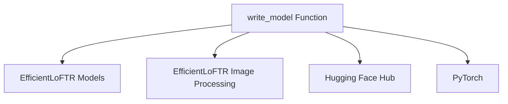

# EfficientLoFTR Model Conversion Module

## Introduction

The `efficientloftr_models_model_conversion` module is responsible for converting pre-trained EfficientLoFTR model checkpoints from their original format into the Hugging Face Transformers compatible format. This module streamlines the process of integrating EfficientLoFTR models into the Hugging Face ecosystem, enabling users to leverage the library's functionalities for model loading, saving, and inference.

## Architecture and Core Functionality

The primary component of this module is the `write_model` function, which orchestrates the entire conversion process. It handles fetching original checkpoints, transforming their state dictionary keys to match the Hugging Face model architecture, loading the converted weights into a `EfficientLoFTRForKeypointMatching` model, and saving the model in the Hugging Face format. Additionally, it ensures the associated image processor is also saved.

### Core Components

*   **`write_model(model_path, model_repo, file_name, organization, push_to_hub=False)`**
    *   **Purpose:** Converts an EfficientLoFTR model checkpoint to the Hugging Face Transformers format and optionally pushes it to the Hugging Face Hub.
    *   **Functionality:**
        1.  Creates a configuration for the `EfficientLoFTRForKeypointMatching` model.
        2.  Downloads the original model checkpoint from the specified repository.
        3.  Converts the keys of the original state dictionary to align with the Hugging Face model's expected keys.
        4.  Loads the transformed state dictionary into an instance of `EfficientLoFTRForKeypointMatching`.
        5.  Saves the converted model and its configuration locally.
        6.  Performs a safety check by reloading the saved model.
        7.  Optionally verifies model outputs if the model repository is the default one.
        8.  Calls `write_image_processor` to save the corresponding image processor.
        9.  Optionally pushes the model and its configuration to the Hugging Face Hub.

## Module Relationships

This module interacts with several other components and external libraries to perform its conversion tasks:

*   **[EfficientLoFTR Models](efficientloftr_models.md)**: Provides the core `EfficientLoFTRConfig` and `EfficientLoFTRForKeypointMatching` classes for model configuration and instantiation.
*   **[EfficientLoFTR Image Processing](efficientloftr_models_image_processing.md)**: Utilizes the `write_image_processor` function to save the image processing components related to the EfficientLoFTR model.
*   **Hugging Face Hub**: Used for downloading original model checkpoints and optionally pushing the converted models.
*   **PyTorch**: Provides the underlying deep learning framework for model loading and state dictionary manipulation.

<!-- DIAGRAM_JSON
{
    "direction": "TD",
    "nodes": [
        {"id": "write_model_func", "label": "write_model Function", "type": "component", "link": null},
        {"id": "efficientloftr_model", "label": "EfficientLoFTR Models", "type": "external", "link": "efficientloftr_models.md"},
        {"id": "efficientloftr_image_processing", "label": "EfficientLoFTR Image Processing", "type": "external", "link": "efficientloftr_models_image_processing.md"},
        {"id": "huggingface_hub", "label": "Hugging Face Hub", "type": "external", "link": null},
        {"id": "pytorch", "label": "PyTorch", "type": "external", "link": null}
    ],
    "edges": [
        {"source": "write_model_func", "target": "efficientloftr_model"},
        {"source": "write_model_func", "target": "efficientloftr_image_processing"},
        {"source": "write_model_func", "target": "huggingface_hub"},
        {"source": "write_model_func", "target": "pytorch"}
    ],
    "groups": []
}
-->

